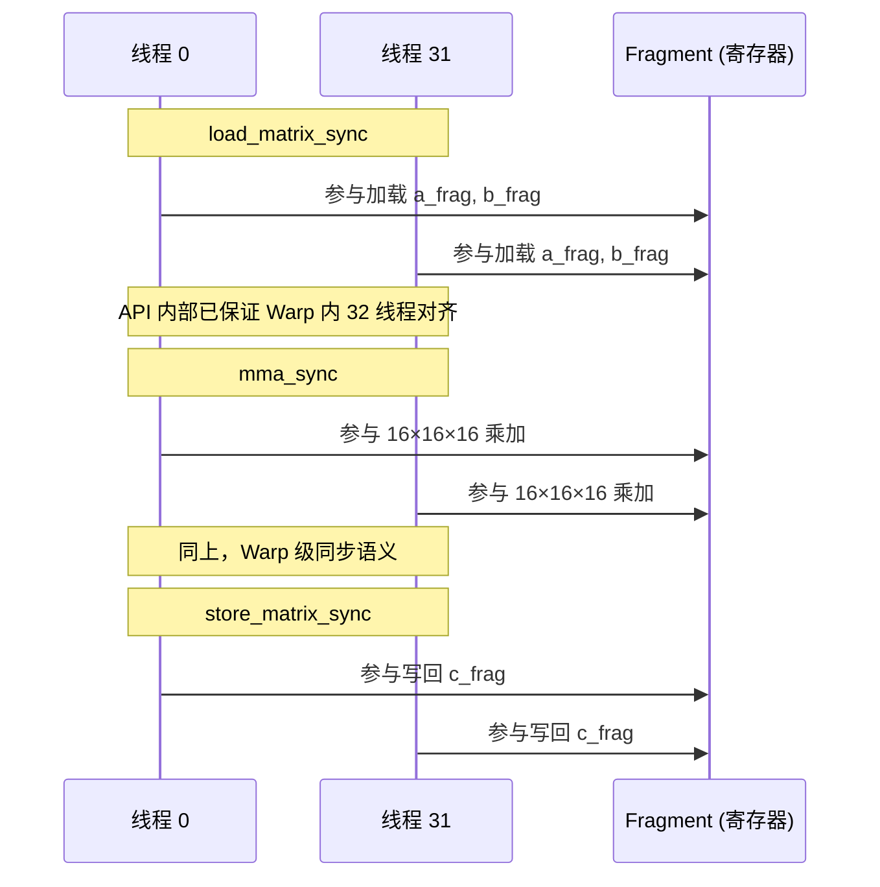
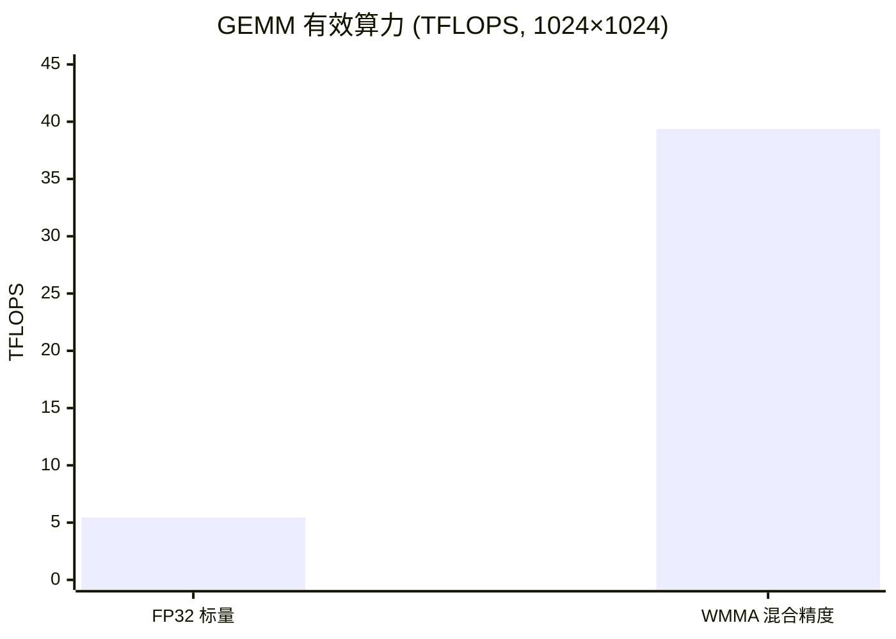

## 本文目标

读完本文，你将能够：

- 理解 Tensor Core 的微架构与 WMMA（Warp Matrix Multiply-Accumulate）指令：为何单次 `mma_sync` 能完成 16×16×16 的矩阵乘加
- 掌握 `wmma::fragment` 抽象，理解数据在 Warp 内 32 线程间的分布及 `load_matrix_sync` / `mma_sync` / `store_matrix_sync` 的协作语义
- 理解混合精度（FP16 输入 + FP32 累加）如何兼顾带宽与数值稳定，避免长链 FP16 累加的截断与「大数吃小数」
- 通过实测对比 FP32 标量 GEMM 与 WMMA 混合精度 GEMM，理解 Tensor Core 带来的算力提升及与硬件峰值的差距

## 对应代码路径

> **硬件环境**：NVIDIA RTX 4090 (Ada Lovelace, sm_89)
> 128 SMs | FP32 82.6 TFLOPS | HBM 1008 GB/s | L2 72 MB | Roofline 拐点 81.9 FLOP/Byte

| 源文件 | Kernel 名称 | 核心技术 | 测试规模 |
|--------|-------------|----------|----------|
| `09_Tensor_Core/01_wmma_gemm/wmma_gemm.cu` | `wmma_gemm_naive` | `<mma.h>`、Fragment 存取、16×16×16 WMMA | M=N=K=2048 |
| `09_Tensor_Core/02_mixed_precision/mixed_precision.cu` | `gemm_fp32_kernel` | FP32 CUDA Core 标量 GEMM 基准 | M=N=K=1024 |
| `09_Tensor_Core/02_mixed_precision/mixed_precision.cu` | `wmma_mixed_gemm_kernel` | FP16 输入 + FP32 累加混合精度 WMMA | M=N=K=1024 |

> **本篇在系列中的位置**：承接 [04 矩阵乘优化与寄存器分块](/posts/1a09f6f/) 的寄存器分块、[07 量化、半精度与整数推理](/posts/ef325d2f/) 的 FP16 数据类型，本篇从**硬件指令级**把 GEMM 从 CUDA Core 标量 FMA 升级到 **Tensor Core WMMA**（16×16×16 矩阵乘加），并说明混合精度如何兼顾吞吐与数值稳定。后续 [14 模板矩阵乘与代数布局](/posts/f1b57921/) 会在 Shared Memory Tiling 下进一步压榨 WMMA；[11 推理优化、融合与键值缓存](/posts/9729c03f/) 则把 Tensor Core 置于完整推理流水线中理解。

---

## 三个实现分别做了什么

### 1. FP32 标量 GEMM：CUDA Core 基准

`gemm_fp32_kernel` 与 [01 基础概念与分块](/posts/7608f1b0/) 的 Naive GEMM 同构：每个线程负责 $C$ 矩阵的一个输出元素，沿 $K$ 维度做内积 $C_{i,j} = \sum_{k} A_{i,k} B_{k,j}$，使用 `float` 读写。Block 配置为 `dim3(16, 16)`（256 线程），覆盖整个 $C$。

它的价值在于建立一个**纯 CUDA Core、无 Tensor Core** 的 GEMM 基准——算力受 FP32 标量 FMA 吞吐与访存带宽双重限制，用于对比后续 WMMA 的收益。

```cpp
// 来源：09_Tensor_Core/02_mixed_precision/mixed_precision.cu : L9-L19
__global__ void gemm_fp32_kernel(CPFloat A, CPFloat B, PFloat C, CInt M, CInt N, CInt K) {
    CInt row = blockIdx.y * blockDim.y + threadIdx.y;
    CInt col = blockIdx.x * blockDim.x + threadIdx.x;

    if (row < M && col < N) {
        float sum = 0.0f;
        for (int i = 0; i < K; ++i) {
            sum += A[row * K + i] * B[i * N + col];
        }
        C[row * N + col] = sum;
    }
}
```

### 2. Naive WMMA GEMM：Tensor Core 16×16×16

`wmma_gemm_naive` 使用 `<mma.h>` 的 `wmma::fragment` 与 `wmma::load_matrix_sync` / `wmma::mma_sync` / `wmma::store_matrix_sync`。每个 **Warp**（32 线程）协作完成一块 $16 \times 16$ 的输出 Tile，沿 $K$ 以 16 为步长滑动：每次从 Global Memory 加载 $16\times 16$ 的 $A$ 块和 $B$ 块到 Fragment，调用 `wmma::mma_sync` 执行 $D = A \times B + C$（累加器为 FP32），再写回 $C$。

与 [01 基础概念与分块](/posts/7608f1b0/) 的 Tiled GEMM 不同，这里**没有**先把数据装填到 Shared Memory，而是直接从 Global Memory 加载到 Fragment（寄存器级），因此仍受全局访存延迟牵制；但单次 `mma_sync` 完成 16×16×16 = 4096 次乘加，指令级并行度远高于标量 FMA。

```cpp
// 来源：09_Tensor_Core/01_wmma_gemm/wmma_gemm.cu : L9-L42
__global__ void wmma_gemm_naive(const half* A, const half* B, PFloat C, CInt M, CInt N, CInt K) {
    CInt warp_col = blockIdx.x;
    CInt warp_row = blockIdx.y * blockDim.y + threadIdx.y;
    CInt row = warp_row * WMMA_M;
    CInt col = warp_col * WMMA_N;
    if (row >= M || col >= N) return;

    wmma::fragment<wmma::matrix_a, WMMA_M, WMMA_N, WMMA_K, half, wmma::row_major> a_frag;
    wmma::fragment<wmma::matrix_b, WMMA_M, WMMA_N, WMMA_K, half, wmma::row_major> b_frag;
    wmma::fragment<wmma::accumulator, WMMA_M, WMMA_N, WMMA_K, float> c_frag;
    wmma::fill_fragment(c_frag, 0.0f);

    for (int i = 0; i < K; i += WMMA_K) {
        wmma::load_matrix_sync(a_frag, A + row * K + i, K);
        wmma::load_matrix_sync(b_frag, B + i * N + col, N);
        wmma::mma_sync(c_frag, a_frag, b_frag, c_frag);
    }
    wmma::store_matrix_sync(C + row * N + col, c_frag, N, wmma::mem_row_major);
}
```

Block 配置为 `dim3(32, 8)`（256 线程，8 个 Warp）；每个 Warp 对应 $C$ 的一个 16×16 块，Grid 在 $N$ 方向以 16 列为单位、在 $M$ 方向以 128 行为单位覆盖。

### 3. 混合精度 WMMA：FP16 输入 + FP32 累加

`wmma_mixed_gemm_kernel` 与 Naive WMMA 的流程一致，明确采用 **FP16 输入、FP32 累加**：`a_frag`、`b_frag` 为 `half`，`c_frag` 为 `wmma::accumulator<float>`。这样在保持 Tensor Core 高吞吐的同时，避免长链 FP16 累加导致的尾数截断与「大数吃小数」现象，兼顾 [07 量化、半精度与整数推理](/posts/ef325d2f/) 中的带宽收益与数值稳定。

---

## Baseline 与瓶颈分析

### FP32 标量 GEMM 的算力与带宽瓶颈

在 `gemm_fp32_kernel` 中，每个线程独立读取 $A$ 的一行、$B$ 的一列并执行 $K$ 次 FMA，没有利用 Tensor Core 的矩阵级指令。单线程每次循环仅完成 2 FLOPs（1 次乘加），且需从 Global Memory 取数；$M=N=K=1024$ 时总计算量约 $2 \times 1024^3 \approx 2.14$ GFLOPs [理论]，但受标量 FMA 吞吐与访存延迟限制，实测有效算力仅 5.45 TFLOPS、有效带宽 31.96 GB/s [实测]，远低于 RTX 4090 的 FP32 峰值 82.6 TFLOPS 与 HBM 1008 GB/s。

### Tensor Core 峰值与 WMMA 的访存牵制

RTX 4090 的 FP16 Tensor Core 理论峰值约 **165 TFLOPS**（无稀疏）[理论]。WMMA 一次 `mma_sync` 完成 16×16×16 的矩阵乘加，等效 8192 次乘加（约 16K FLOPs），单条指令吞吐远高于标量 FMA。但 Naive WMMA 从 **Global Memory** 直接 `load_matrix_sync`，每次沿 $K$ 步进 16 都要做两次全局加载；在缺乏 Shared Memory Tiling 的情况下，Tensor Core 大量时间在等待数据，因此实测 30–40 TFLOPS 仍与 165 TFLOPS 峰值有数倍差距。

---

## 优化思路：WMMA 与混合精度如何提升算力与精度

### 核心思想

- **WMMA 替代标量 FMA**：通过 `wmma::load_matrix_sync` + `wmma::mma_sync` + `wmma::store_matrix_sync`，让一个 Warp 以**矩阵块**为单位消费数据，单次调用完成 16×16×16 的乘加，充分利用 Tensor Core 的硬件矩阵单元，在相同访存次数下大幅提高算力。
- **混合精度**：输入 $A$、$B$ 使用 `half`（FP16）以减半全局访存字节数；累加器使用 `wmma::accumulator<float>`（FP32），在 Tensor Core 内部以高精度累加，写回 $C$ 时再存为 FP32，避免长链 FP16 累加导致的数值不稳定。

### WMMA Fragment 与 16×16×16 约束

| 概念 | 含义 |
|------|------|
| `wmma::fragment<..., WMMA_M, WMMA_N, WMMA_K, ...>` | 本项目中 M=N=K=16，即 16×16×16 Tile |
| `matrix_a` / `matrix_b` | $A$、$B$ 的寄存器碎片，在 Warp 内 32 线程间分布 |
| `accumulator` | 累加结果碎片，通常用 `float` 以支持混合精度 |
| `load_matrix_sync` / `store_matrix_sync` | 带 Warp 内同步的加载/写回，与 `mma_sync` 之间无需额外 `__syncthreads()` |

矩阵维度若非 16（或 8）的整数倍，需 Padding 或边界分支处理。

### 混合精度为何用 FP32 累加

纯 FP16 累加时，$K$ 很大（如 1024）会导致多次 FP16 加法的舍入误差累积，且动态范围有限，易出现「大数吃小数」。用 FP32 累加、仅输入为 FP16，可在几乎不增加访存的前提下（输入仍为 half），在芯片内部保持高精度累加，写回时再转为 FP32 或按要求舍入，兼顾吞吐与数值安全。

---

## 关键代码解释

### 混合精度 WMMA Kernel：Fragment + load / mma / store

```cpp
// 来源：09_Tensor_Core/02_mixed_precision/mixed_precision.cu : L22-L41
__global__ void wmma_mixed_gemm_kernel(const half* A, const half* B, float* C, CInt M, CInt N, CInt K) {
    // [1] 将当前 Warp 映射到输出矩阵 C 的 16×16 Tile
    CInt warpM = (blockIdx.y * blockDim.y + threadIdx.y) * WMMA_M;
    CInt warpN = (blockIdx.x * blockDim.x / 32) * WMMA_N;

    if (warpM >= M || warpN >= N) return;

    // [2] 声明 Fragment：输入 half，累加器 float
    wmma::fragment<wmma::matrix_a, WMMA_M, WMMA_N, WMMA_K, half, wmma::row_major> a_frag;
    wmma::fragment<wmma::matrix_b, WMMA_M, WMMA_N, WMMA_K, half, wmma::row_major> b_frag;
    wmma::fragment<wmma::accumulator, WMMA_M, WMMA_N, WMMA_K, float> c_frag;
    wmma::fill_fragment(c_frag, 0.0f);

    // [3] 沿 K 滑动：加载 → mma_sync → 写回
    for (int k = 0; k < K; k += WMMA_K) {
        wmma::load_matrix_sync(a_frag, A + warpM * K + k, K);
        wmma::load_matrix_sync(b_frag, B + k * N + warpN, N);
        wmma::mma_sync(c_frag, a_frag, b_frag, c_frag);
    }
    wmma::store_matrix_sync(C + warpM * N + warpN, c_frag, N, wmma::mem_row_major);
}
```

- **[1]**：每个 Warp 负责 $C$ 的一块 16×16，故 `warpN` 以 `blockDim.x / 32`（Warp 数）为步长。
- **[2]**：`wmma::fragment` 在底层对应 Warp 内 32 线程的私有寄存器分布，不可假设具体布局。
- **[3]**：`load_matrix_sync`、`mma_sync`、`store_matrix_sync` 均具 Warp 级同步语义，无需再插 `__syncthreads()`。

### Block / Thread 映射

| 层级 | 配置 | 职责 |
|------|------|------|
| Grid | 由 `blockDim` 与 M、N 决定，以 16×16 为 Tile 单位 | 覆盖整个 $C$ 矩阵 |
| Block | `dim3(32, WARPS_PER_BLOCK_Y)`，每 Block 多个 Warp | 每个 Warp 计算一块 16×16 的 $C$ |
| Warp | 32 线程 | 共同执行 load_matrix_sync → mma_sync → store_matrix_sync，Fragment 分布在 32 线程寄存器中 |

### WMMA 内 Warp 同步为何无需 `__syncthreads()`



`load_matrix_sync`、`mma_sync`、`store_matrix_sync` 本身即带 Warp 内同步语义，参与同一 Fragment 的 32 线程会在此类 API 内对齐。只有**跨 Warp** 的协作（例如多 Warp 共写一块 Shared Memory）才需要 Block 级 `__syncthreads()`。

### 数据流总览

```mermaid
graph TD
    classDef gm fill:#f9d0c4,stroke:#333,stroke-width:2px;
    classDef frag fill:#bbf,stroke:#333,stroke-width:2px;

    subgraph "Global Memory (HBM)"
        A["A (half)"]:::gm
        B["B (half)"]:::gm
        C["C (float)"]:::gm
    end

    subgraph "Warp Fragment (寄存器)"
        AF["a_frag"]:::frag
        BF["b_frag"]:::frag
        CF["c_frag (FP32 acc)"]:::frag
    end

    A -- "load_matrix_sync" --> AF
    B -- "load_matrix_sync" --> BF
    AF --> "mma_sync" --> CF
    BF --> "mma_sync" --> CF
    CF -- "store_matrix_sync" --> C
```

---

## 结果与边界

### WMMA Naive 性能（M=N=K=2048，100 次迭代取平均）

> 数据来源：`Results/09_Tensor_Core.md` 原始日志

| 版本 | Kernel 耗时 | 有效算力 | 数据性质 |
|------|------------|---------|----------|
| **wmma_gemm_naive** | **0.56 ms** | **30.50 TFLOPS** | [实测] |

2048×2048 规模下，Naive WMMA 从 Global Memory 直接加载 Fragment，无 Shared Memory 中间层，Tensor Core 仍受访存延迟牵制。

### 混合精度对比（M=N=K=1024，100 次迭代取平均）

> 数据来源：`Results/09_Tensor_Core.md` 原始日志

| 版本 | Kernel 耗时 | 有效算力 | 有效带宽 | vs FP32 | 数据性质 |
|------|------------|---------|----------|--------|----------|
| FP32 标量 (gemm_fp32_kernel) | 0.39 ms | 5.45 TFLOPS | 31.96 GB/s | 1.00x | [实测] |
| **WMMA 混合精度** | **0.05 ms** | **39.36 TFLOPS** | **153.73 GB/s** | **7.21x** | [实测] |

同规模下切换到 WMMA 并采用 FP16 输入 + FP32 累加，Kernel 耗时降至约 1/7，有效算力约 7 倍、有效带宽约 5 倍（FP16 输入减半访存字节数）。



### 为什么 WMMA 仍远低于 165 TFLOPS 峰值

39.36 TFLOPS 仅为 RTX 4090 FP16 Tensor Core 理论峰值（约 165 TFLOPS）的 **24%** 量级 [实测/理论]。原因在于本实现是 **Naive WMMA**：沿 $K$ 每步都从 **Global Memory** 做 `load_matrix_sync`，没有先用 Shared Memory 做 Tiling 与多级缓冲，Tensor Core 大量周期在等待全局访存。要逼近峰值，需要像 [04 矩阵乘优化与寄存器分块](/posts/1a09f6f/) 那样，把数据先装填到 Shared Memory，再以 Tile 为单位喂给 WMMA，并配合流水与双缓冲，这正是 [14 模板矩阵乘与代数布局](/posts/f1b57921/) 的方向。

### 边界与局限

- **Tile 尺寸约束**：WMMA 的 16×16×16（或 8×8×8 等）形状是硬件固定的，矩阵维度若非 16 或 8 的整倍数，需 Padding 或边界分支，会带来额外开销与填充浪费。
- **架构依赖**：WMMA 需 Volta (sm_70) 及以上；RTX 4090 为 Ada (sm_89)，完全支持。不同架构的 Tensor Core 代数与峰值不同，需以实际规格为准。

---

## 常见误区

1. **误区**：用 WMMA 时只要传入 FP16 矩阵做全链条 FP16 运算即可，不必配混合精度。
   **实际**：长链 FP16 累加会带来尾数截断与动态范围不足，易出现「大数吃小数」和数值异常。必须用 **FP16 输入 + FP32 累加**（`wmma::accumulator<float>`）在内部保持高精度，再写回 FP32 或按要求舍入。

2. **误区**：为了调试可以遍历 `c_frag.x[i]` 把 Fragment 当普通数组打印。
   **实际**：Fragment 数据按 Warp 内线程分布在私有寄存器中，布局由实现定义，不可假设。直接按索引访问得到的是无业务意义的交织数据，调试应依赖 store 到全局内存后再比对。

3. **误区**：有了 Tensor Core 就可以无差别加速所有矩阵/向量乘法（如 M=1 的向量乘矩阵）。
   **实际**：Tensor Core 针对**块状**矩阵乘（如 16×16×16）优化，高度失衡的 shape（如 1×N×K）无法喂满流水线，利用率极低，有时反而不如 CUDA Core 标量或向量化实现。应优先用于方阵或接近方阵的 GEMM。

4. **误区**：WMMA 里 load/store 和 mma_sync 之间需要自己加 `__syncthreads()`。
   **实际**：`load_matrix_sync`、`mma_sync`、`store_matrix_sync` 本身即带 Warp 内同步语义，参与同一 Fragment 的 32 线程会在此类 API 内对齐，无需再插 `__syncthreads()`。跨 Warp 的协作才需要 Block 级 `__syncthreads()`。

---

## 系列导航

### 前置阅读

| 文章 | 与本篇的衔接 |
|------|----------------|
| [01 基础概念与分块](/posts/7608f1b0/) | 建立 GEMM、Tiling 与存储层级直觉；本篇 FP32 基准与 01 的 Naive GEMM 同构 |
| [04 矩阵乘优化与寄存器分块](/posts/1a09f6f/) | 掌握 CUDA Core 下的 Register Tiling 与双缓冲，再理解本篇如何用 WMMA 在**指令级**替代标量 FMA |
| [07 量化、半精度与整数推理](/posts/ef325d2f/) | FP16 数据类型与带宽收益、数值范围与舍入；本篇 WMMA 的 FP16 输入 + FP32 累加正是该思路在 Tensor Core 上的落地 |

### 推荐后续（承上启下）

| 文章 | 与本篇的衔接 |
|------|----------------|
| [14 模板矩阵乘与代数布局](/posts/f1b57921/) | 工业级模板如何对 WMMA 做 Shared Memory Tiling、流水与多级分块，把本篇的 Naive WMMA 推到接近硬件峰值 |
| [11 推理优化、融合与键值缓存](/posts/9729c03f/) | 推理系统中 Tensor Core 与算子融合、KV Cache 的配合，形成端到端 LLM 推理优化视角 |

---

## 顺序导航

- 上一篇：[CUDA实践-08-多流图执行与扩展开发](/posts/b1c0c6a3/)
- 下一篇：[CUDA实践-10-访存优化与共享内存冲突](/posts/5b6f891d/)
