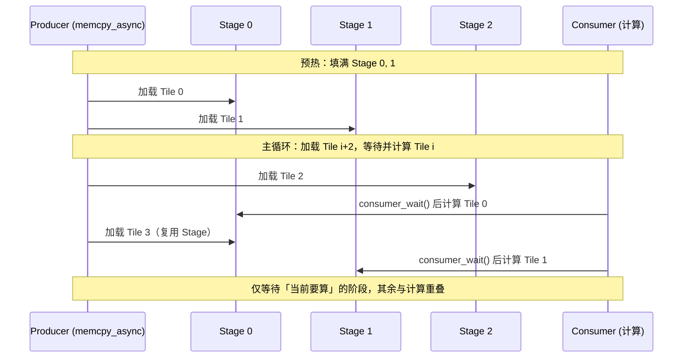
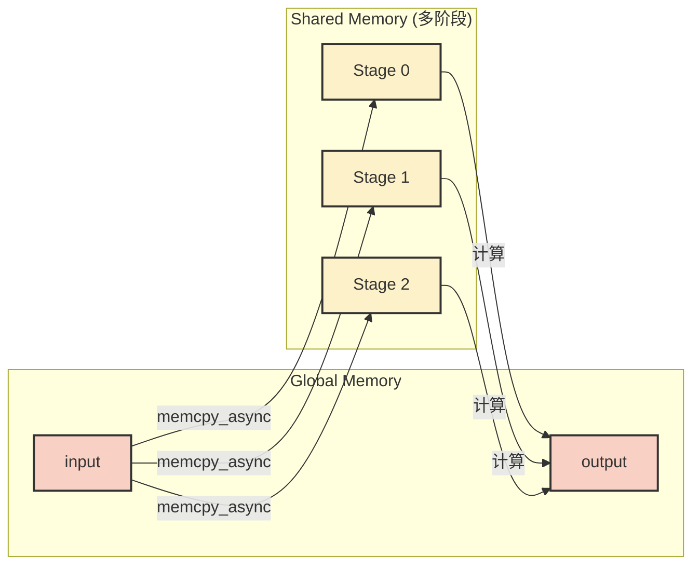
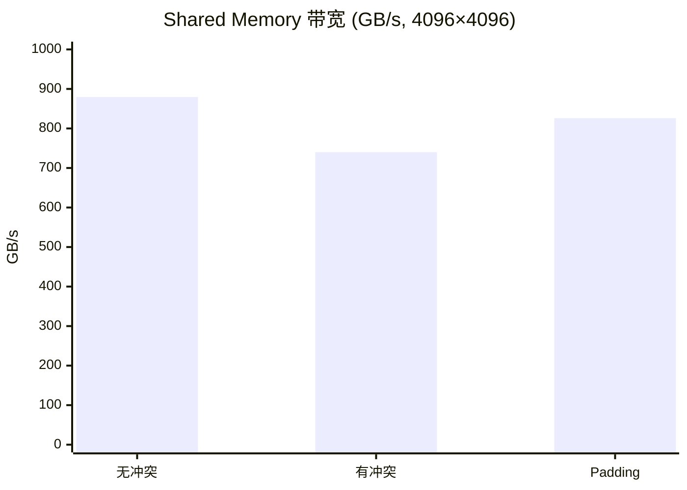

## 本文目标

读完本文，你将能够：

- 理解 Global Memory 合并访存（Coalesced Access）：为什么 Warp 内“连续/同址”的访问可以被打包成少量事务，而跨步/随机会让事务数暴涨、带宽崩塌
- 能用 **“事务数 × 事务粒度”** 的心智模型解释 Stride=1 vs 2 的差距，并用 Nsight Compute 或带宽实测验证（含 L2 对小规模的遮蔽效应）
- 理解 Shared Memory 的 **32 Bank 映射**：为什么“列访问 + stride=32”会触发 32-way Bank Conflict，并掌握 **Padding+1** 的推导与写法
- 理解 `cg::memcpy_async` 与 `cuda::pipeline` 的异步拷贝/流水语义：为什么它不保证“必然更快”，以及它真正擅长覆盖哪类延迟

## 对应代码路径

> **硬件环境**：NVIDIA RTX 4090 (Ada Lovelace, sm_89)
> 128 SMs | FP32 82.6 TFLOPS | HBM 1008 GB/s | L2 72 MB | Roofline 拐点 81.9 FLOP/Byte

| 源文件 | Kernel 名称 | 核心技术 | 测试规模 |
|--------|-------------|----------|----------|
| `10_Memory_Optimization/01_coalesced_access/coalesced_access.cu` | `coalesced_access`、`strided_access`、`aos_access`、`soa_access` | Global 合并访存 Stride=1 vs 2、AoS vs SoA | N=16.7M（单数组 64 MB） |
| `10_Memory_Optimization/02_bank_conflict/bank_conflict.cu` | `no_bank_conflict`、`with_bank_conflict`、`padded_no_conflict` | Shared 行/列访问、32-way 冲突、Padding+1 消除 | 4096×4096（64 MB） |
| `10_Memory_Optimization/03_async_copy/async_copy.cu` | `sync_copy_kernel`、`async_copy_kernel`、`pipeline_kernel` | 同步拷贝、`cg::memcpy_async`、`cuda::pipeline` 多阶流水 | N=67M（256 MB） |

> **本篇在系列中的位置**：承接 [01 基础概念与分块](/posts/7608f1b0/) 的合并访存与 Tiling、[06 线程束原语与寄存器通信](/posts/fec051fc/) 的寄存器通信（规避 Shared Bank 冲突），本篇系统拆解**三层访存瓶颈**：Global 合并（Coalescing）、Shared Bank 冲突与 Padding、Global↔Shared 的 Async Copy。后续 [08 多流、图执行与扩展开发](/posts/b1c0c6a3/) 用 Multi-Stream 掩盖 H2D/D2H；[11 推理优化、融合与键值缓存](/posts/9729c03f/) 在推理链路中复用本篇的合并与 Bank 优化；[13 性能分析、屋顶线与占用率](/posts/803b94d6/) 用 Nsight 量化 Bank 冲突与带宽。

---

## 三个实现分别做了什么

### 1. 合并访存与跨步：Global Memory 的“事务打包”

`coalesced_access` 与 [01 基础概念与分块](/posts/7608f1b0/) 的 Vector Add 一样，是最“干净”的带宽基准：每线程处理一个元素，Warp 内 32 个线程访问 **连续** 的 32 个 `float`。硬件会把这些标量请求**尽量合并**为少量对齐的大事务（通常你可以把它近似成“128B 事务/Cache line 的搬运”）。

`strided_access` 只改一行：`actual_idx = idx * stride`（本实现测 stride=2）。同一 Warp 内线程访问的地址变成“隔一个元素”，从 **“连续”** 变成 **“稀疏”**，硬件需要发出更多事务才能把数据搬齐，导致有效带宽显著下降。

`aos_access` / `soa_access` 用同一套算子对比 AoS（Array of Structures）与 SoA（Structure of Arrays）。要点是：**AoS 是否慢，不取决于“叫 AoS”，而取决于“你到底读哪些字段”**。本实验的 AoS 版本一次读写 x/y/z/w 四字段，访问仍然可以合并，所以与 SoA 接近；如果你的 kernel 只读一个字段（例如只读 `x`），那 AoS 会把其它字段当“垃圾带宽”一起搬走，才会显著变慢。

```cpp
// 来源：10_Memory_Optimization/01_coalesced_access/coalesced_access.cu : L17-L31
__global__ void coalesced_access(CPFloat input, PFloat output, CInt n) {
    int idx = blockIdx.x * blockDim.x + threadIdx.x;
    if (idx < n) {
        output[idx] = input[idx] * 2.0f;  // 连续访问，合并
    }
}

__global__ void strided_access(CPFloat input, PFloat output, CInt n, CInt stride) {
    int idx = blockIdx.x * blockDim.x + threadIdx.x;
    int actual_idx = idx * stride;  // 跨步访问
    if (actual_idx < n) {
        output[actual_idx] = input[actual_idx] * 2.0f;
    }
}
```

Block 配置为 256 或 1024 线程（依 `BLOCK_SIZE`），Grid 覆盖全部元素。合并版本将显存带宽压榨到接近峰值；跨步版本在同一数据量下有效带宽约折半 [实测]。

### 2. Bank 冲突与 Padding：Shared Memory 的“列访问陷阱”

`no_bank_conflict` 是 Shared 的“理想形态”：按行写入、按行读出。Warp 内 32 个线程访问 `shared[ty][tx]` 时 `tx` 连续，对应到不同 Bank，硬件可以并行服务，无冲突。

`with_bank_conflict` 刻意制造最常见的坑：写入仍按行（利于加载合并），但在 `__syncthreads()` 后按**列**读取 `shared[tx][ty]`（本质是“转置访问”）。为了让 Global 的写回保持合并，它在写回 `output` 时会用转置坐标；但 Shared 的读取因此变成“同一列、不同行”。当 tile 的 stride 恰好是 32（`shared[32][32]`）时，这种列访问会触发 **32-way Bank Conflict**，访问被串行化。

`padded_no_conflict` 的修复非常“硬核但朴素”：只多开一列，让 stride 从 32 变成 33：`shared[32][33]`。列访问时，同一列相邻行的线性地址差从 32 变成 33，**不再在模 32 的意义下对齐**，从而把 32 个线程分散到 32 个 Bank，冲突消失。

```cpp
// 来源：10_Memory_Optimization/02_bank_conflict/bank_conflict.cu : L29-L54, L57-L80
// 有冲突：列读取 shared[tx][ty]，同一 Warp 同列 → 32-way 冲突
__global__ void with_bank_conflict(CPFloat input, PFloat output, CInt n) {
    __shared__ float shared[TILE_SIZE][TILE_SIZE];
    // ... 行写入 shared[ty][tx] ...
    __syncthreads();
    // 列读取：output 用转置下标保证合并写，但 shared[tx][ty] 撞 Bank
    output[out_idx] = shared[tx][ty] * 2.0f;
}

// 无冲突：列宽 +1，同一列相邻行错开 Bank
__global__ void padded_no_conflict(CPFloat input, PFloat output, CInt n) {
    __shared__ float shared[TILE_SIZE][TILE_SIZE + 1];
    // ... 行写入 shared[ty][tx]，列读取 shared[tx][ty]，因 stride 33 不再同 Bank
    output[out_idx] = shared[tx][ty] * 2.0f;
}
```

Block 配置为 `dim3(32, 32)`（TILE_SIZE=32），Grid 覆盖 4096×4096 矩阵。

### 3. 同步拷贝与异步流水：Global → Shared 的“搬运-计算”管线

`sync_copy_kernel` 是最直观的“搬运-计算”模板：每个 Tile 先同步把 Global 装进 Shared，然后 `__syncthreads()`，再计算并写回 Global，最后进入下一 Tile。流程清晰，但“搬运”和“计算”基本串行——LSU 忙时 ALU 闲，ALU 忙时 LSU 闲。

`async_copy_kernel` 用 `cg::memcpy_async` 演示“集体异步拷贝”的语义：Block 发起拷贝，随后在 `cg::wait` 处等待数据就绪再计算。**单阶异步**的关键收获是“你可以把拷贝的发起与等待拆开”，但如果你发起后立刻等待，它在结构上仍接近同步拷贝（主要用于熟悉 API 与约束）。

`pipeline_kernel` 进一步把 Shared 变成多缓冲（multi-buffer）：`stage=0/1/2...`。生产者用 `cuda::memcpy_async` 预取下一 Tile，消费者只对“当前需要算的那一段”做 `consumer_wait()`，从而让**搬运与计算重叠**。但这并不意味着“必然更快”——本测试的算子几乎是纯带宽搬运（乘 2 写回），单 Tile 计算很轻，重叠空间不足以抵消流水管理成本，所以多阶段流水会略慢（约 0.95x）[实测]。把同样的技术搬到 GEMM 这类重计算内核里，重叠空间才足够大，优势才明显。

---

## Baseline 与瓶颈分析

### 1. 合并访存的“事务数”瓶颈

我们把问题抽象成一句话：**带宽不是“每秒能搬多少标量”，而是“每秒能完成多少内存事务”**。同样是读 32 个 `float`：

- 合并访问（Stride=1）：这 32×4B 是连续的，硬件能用很少的事务把它搬齐
- 跨步访问（Stride=2）：这 32 个线程触达的地址跨度翻倍，覆盖的 Cache line/事务更多，导致“搬运同样多的有效字节，却需要更多事务”，有效带宽就会下降

本实验里，合并访问每元素读 4B 写 4B，有效带宽约 925 GB/s [实测]，已接近 RTX 4090 理论 1008 GB/s；而 stride=2 的跨步有效带宽约 427 GB/s [实测]，接近折半，符合“事务数显著增加”的直觉。

> 重要边界：当数据规模较小、能被 L2 充分缓存时，很多“本该打到 HBM 的事务”被 L2 拦截，差距会被部分遮蔽；把规模扩大到明确溢出 L2 后，合并/非合并的差距通常更稳定。

### 2. Bank 冲突的“串行化”瓶颈

Shared Memory 的吞吐“看起来像寄存器”，但它仍然有结构：通常可近似认为它由 **32 个 Bank** 组成（每 Bank 4B 宽，面向 `float`），同一时刻每个 Bank 最理想只能服务一个不同地址请求（同址广播例外）。

令 Bank 映射为：

$$bank = \left(\frac{addr}{4}\right) \bmod 32 \quad [\text{理论}]$$

对二维数组 `shared[row][col]`（行主序）：

$$offset = row \cdot stride + col \quad [\text{理论}]$$

当 `stride = 32` 且你做列访问（同 `col`，不同 `row`），相邻两行的 `offset` 差是 32：

$$offset(row+1,col) - offset(row,col) = 32 \equiv 0 \pmod{32}$$

于是它们落在同一个 Bank，Warp 内 32 线程就形成 32-way 冲突，被硬件串行化。对应到实测：无冲突（行读）有效带宽约 879 GB/s；有冲突（列读）降到约 740 GB/s，耗时约 1.19x [实测]；Padding 后恢复到约 826 GB/s，与无冲突接近 [实测]。

### 3. Async Copy 的收益边界：不是“更快”，而是“更可重叠”

同步拷贝把每个 Tile 拆成“搬运”和“计算”两段，几乎串行；流水化的目标是把它改成：

$$\text{搬运}(i+1)\ \parallel\ \text{计算}(i)$$

它的收益上限由“可重叠空间”决定。如果单 Tile 计算时间 \(T_\text{compute}\) 远小于拷贝时间 \(T_\text{copy}\)，那么重叠最多只能遮住一小段 \(T_\text{compute}\)，而流水本身还有阶段管理/同步成本；因此在本实验这种“纯带宽搬运 + 轻计算”里，多阶段流水反而可能略慢（0.95x）[实测]。当你把同样的手法用到 GEMM 这类 \(T_\text{compute}\) 足够重的内核时，重叠空间变大，流水才会显著占优。

---

## 优化思路：合并、Padding 与异步流水如何破局

### 核心思想

- **合并访存**：让 `threadIdx.x` 与线性下标同向增长，使 Warp 内地址 **连续**（或同址广播）。一旦你引入跨步/间接索引，就要警惕“事务数膨胀”。
- **Bank 冲突与 Padding**：当你必须做 Shared 的转置/列访问时，先算 `stride` 是否与 32 同余；若 `stride ≡ 0 (mod 32)`，极易 32-way 冲突。典型解法是 **stride+1**（`[TILE][TILE+1]`）。
- **异步流水**：把“发起拷贝”与“等待可用”分离，并用多阶段缓冲把“搬运下一块”塞进“计算当前块”的时间缝隙里。它解决的是**重叠**问题，而不是凭空提高原始带宽。

### 合并与跨步对比（简要）

| 访问模式 | Warp 内地址关系 | 事务数（理想） | 有效带宽（本测试量级） |
|----------|------------------|----------------|------------------------|
| Stride=1 合并 | 连续 32×4 B | 1 个 128B 事务 | ~925 GB/s [实测] |
| Stride=2 跨步 | 每隔一元素 | 无法合并，浪费带宽 | ~427 GB/s [实测] |

### Shared Memory Bank 与 Padding 的“算清楚”

| 概念 | 含义 |
|------|------|
| 32 Banks | 每 4 字节一个 Bank，线性地址 `addr` 对应 Bank = `(addr / 4) % 32` |
| 行主序 `[row][col]` | 元素 `(r, c)` 的线性偏移 = `r * stride + c`，stride=32 时同列同 Bank |
| Padding+1 | `stride = 33`，同列相邻行偏移差 33，$33 \not\equiv 0 \pmod{32}$，故不同 Bank |

---

## 关键代码解释

### Padding 消除列访问 Bank 冲突

```cpp
// 来源：10_Memory_Optimization/02_bank_conflict/bank_conflict.cu : L57-L80（节选）
#define TILE_SIZE 32

// 有冲突：shared[32][32]，列访问时 (row*32+col)%32 同列相同
// __shared__ float shared[TILE_SIZE][TILE_SIZE];

// 无冲突：列宽 +1，线性步长 33，同列相邻行错开 Bank
__shared__ float shared[TILE_SIZE][TILE_SIZE + 1];

// 行写入（合并）
shared[ty][tx] = input[in_idx];
__syncthreads();

// 列读取：shared[tx][ty]，因 stride=33，tx 不同时 (tx*33+ty)%32 不同
output[out_idx] = shared[tx][ty] * 2.0f;
```

线性偏移为 `row * stride + col`。`stride = 33` 时，同一列（`col` 相同）相邻两行 `row` 与 `row+1` 的偏移差为 33，$33 \equiv 1 \pmod{32}$，故落在不同 Bank，32-way 冲突消除。

### Block / Thread 映射（Bank 冲突 Kernel，4096×4096）

| 层级 | 配置 | 职责 |
|------|------|------|
| Grid | `(cdiv(n,32), cdiv(n,32))` | 覆盖整矩阵，每 Block 一块 32×32 |
| Block | `dim3(32, 32)` | 协作加载一块 32×32 到 Shared，再写回（无冲突为行写行读，有冲突/Padding 为行写列读） |
| Thread `(tx, ty)` | — | 加载 `input[(by+ty)*n+(bx+tx)]` → `shared[ty][tx]`；读 Shared 后写 `output`（有冲突/Padding 时用转置坐标保证合并写） |

### 多阶段流水线为何只等「当前阶段」



`consumer_wait()` 只阻塞到「当前要消费」的那一阶段数据就绪；在此之前，生产者已在填充其他阶段，实现加载与计算的重叠。本测试中计算极轻，重叠收益不足以抵消流水管理开销，故多阶略慢于同步。

### 数据流总览（Async Copy）



---

## 结果与边界

### 合并访存性能（N = 16,777,216，单数组 64 MB，100 次迭代取平均）

> 数据来源：`Results/10_Memory_Optimization.md` 原始日志

| 版本 | Kernel 耗时 | 有效带宽 | vs 合并 | 数据性质 |
|------|------------|---------|--------|----------|
| **合并访问 (Stride=1)** | **0.15 ms** | **925.31 GB/s** | 1.00x | [实测] |
| 跨步访问 (Stride=2) | 0.16 ms | 427.34 GB/s | 约 0.46x 带宽 | [实测] |

跨步仅一步之差，有效带宽即降至合并版的约 46%，体现合并对 Global Memory 的重要性。

### AoS vs SoA（同规模，256 MB 总数据）

| 版本 | Kernel 耗时 | 有效带宽 | 数据性质 |
|------|------------|---------|----------|
| AoS（四字段同读同写） | 0.58 ms | 922.31 GB/s | [实测] |
| SoA | 0.59 ms | 912.82 GB/s | [实测] |

本实验中 AoS kernel 同时读写 x/y/z/w，访问仍为合并，故与 SoA 接近。并且数据量 64 MB×4 与 L2（72 MB）同量级，L2 会对差异产生一定遮蔽；更大体量明确溢出 L2、打满 HBM 时，合并与否的差距会更稳定。

### Bank 冲突与 Padding（4096×4096，64 MB，100 次迭代取平均）

> 数据来源：`Results/10_Memory_Optimization.md` 原始日志

| 版本 | Kernel 耗时 | 有效带宽 | vs 无冲突 | 数据性质 |
|------|------------|---------|-----------|----------|
| 无冲突（行写行读） | 0.15 ms | 879.49 GB/s | 1.00x | [实测] |
| 有冲突（列读 32-way） | 0.18 ms | 740.07 GB/s | 约 1.19x 耗时 | [实测] |
| **Padding 消除冲突** | **0.16 ms** | **826.01 GB/s** | **与无冲突接近** | [实测] |



### 同步 vs 异步流水（N = 67,108,864，256 MB，100 次迭代取平均）

> 数据来源：`Results/10_Memory_Optimization.md` 原始日志

| 版本 | Kernel 耗时 | 有效带宽 | vs 同步 | 数据性质 |
|------|------------|---------|--------|----------|
| 同步拷贝 | 0.60 ms | 901.43 GB/s | 1.00x | [实测] |
| 单阶异步 | 0.60 ms | 898.00 GB/s | 1.00x | [实测] |
| 多阶流水 (3 Stages) | 0.63 ms | 856.55 GB/s | 0.95x | [实测] |

本测试为纯搬运+轻量计算，多阶流水略慢于同步属预期：计算耗时远小于传输，无法填满流水深沟，且流水有额外调度与同步成本。在重计算 GEMM 中，Async Copy + 多阶流水才能显著掩盖传输、提升吞吐。

### 边界与局限

- **Padding 适用场景**：Padding 不是“万能加速器”，它只对“同一 Warp 的多地址请求落到同一 Bank”这种结构性冲突有效，且要按 `stride mod 32` 推导。对 16×16 或非 32 周期的 tile，需要重新算映射；盲目 Padding 只会增加 Shared 占用、压低占用率。
- **合并是根本**：缓存能遮蔽一部分差距，但它无法把“非合并的访问模式”自动变成“合并”。Warp 内索引一旦稀疏，事务数就会变多，总线压力会真实存在；应从数据布局与线程映射上确保合并。
- **流水的前提**：流水是“用计算覆盖拷贝”的技术，收益依赖 \(T_\text{compute}\) 的重量级。若 \(T_\text{compute} \ll T_\text{copy}\)，流水管理成本可能让它略慢于同步；只有当计算足够重（如 GEMM）时，重叠优势才显著。

---

## 常见误区

1. **误区**：一旦报出 Bank Conflict，随便加一点 Padding 就能解决。
   **实际**：Padding 只在「同一 Warp 访问同一 Bank 不同地址」导致的冲突上有用，且需按线性步长算清余数（如 32 列时加 1 列使步长变 33）。若本身无 32 周期撞 Bank（如 16×16 或奇数阶），盲目 Padding 只会多占 Shared、无益甚至有害。

2. **误区**：有跨步或非合并访问时，只要用 L1 Cache / Texture Cache 锁住就能高枕无忧。
   **实际**：Warp 内无法凑成连续或同址访问时，硬件仍会发起多次内存事务，总线与控制器负载上升，有效带宽骤降。必须从算法与下标设计上保证合并，而不是依赖缓存掩盖。

3. **误区**：Async Copy 和多阶流水一定比同步拷贝快。
   **实际**：在纯带宽型、计算极轻的 Kernel 中，传输占主导，计算无法掩盖加载；多阶流水还有阶段管理与 `consumer_wait` 等开销，实测可能略慢于同步（如 0.95x）。在 GEMM 等重计算场景中，流水才能显著掩盖 Global→Shared 延迟。

4. **误区**：AoS 一定比 SoA 慢，因为「结构体导致跨步」。
   **实际**：若 Kernel 对结构体**所有字段**同读同写（如本实验的 x/y/z/w），访问仍是合并的。只有「仅读单字段、其他字段成为垃圾数据」的 AoS 才会变成非合并。是否合并取决于实际访问模式，而非单纯 AoS/SoA 名称。

---

## 系列导航

### 前置阅读

| 文章 | 与本篇的衔接 |
|------|----------------|
| [01 基础概念与分块](/posts/7608f1b0/) | 建立 Grid/Block/Warp、合并访存与 Shared Tiling 的直观；本篇在 Coalescing 与 Bank 上做定量分析 |
| [06 线程束原语与寄存器通信](/posts/fec051fc/) | Warp Shuffle 用寄存器通信规避 Shared 的 Bank 冲突与 `__syncthreads` 开销；本篇从 Shared 侧讲清冲突成因与 Padding 解法 |

### 推荐后续（承上启下）

| 文章 | 与本篇的衔接 |
|------|----------------|
| [08 多流、图执行与扩展开发](/posts/b1c0c6a3/) | 用 Multi-Stream 掩盖 H2D/D2H，与本篇的「单 Kernel 内合并 + Async Copy」形成系统级与内核级两层访存优化 |
| [11 推理优化、融合与键值缓存](/posts/9729c03f/) | 推理链路中合并访存、Bank 优化与 Async Copy 的落地场景 |
| [13 性能分析、屋顶线与占用率](/posts/803b94d6/) | 用 Nsight Compute 量化 Bank 冲突、带宽与 Roofline 拐点，验证本篇优化效果 |

---

## 顺序导航

- 上一篇：[CUDA实践-09-张量核心与混合精度](/posts/78e375e8/)
- 下一篇：[CUDA实践-11-推理优化融合与键值缓存](/posts/9729c03f/)
