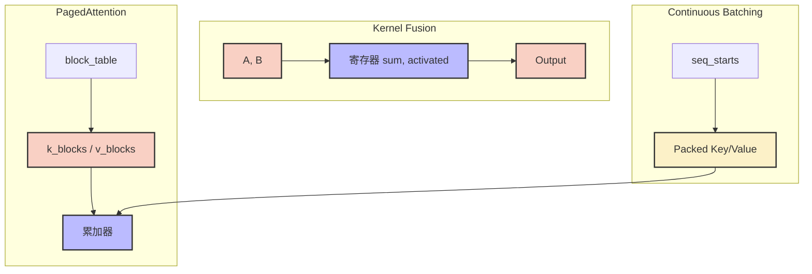
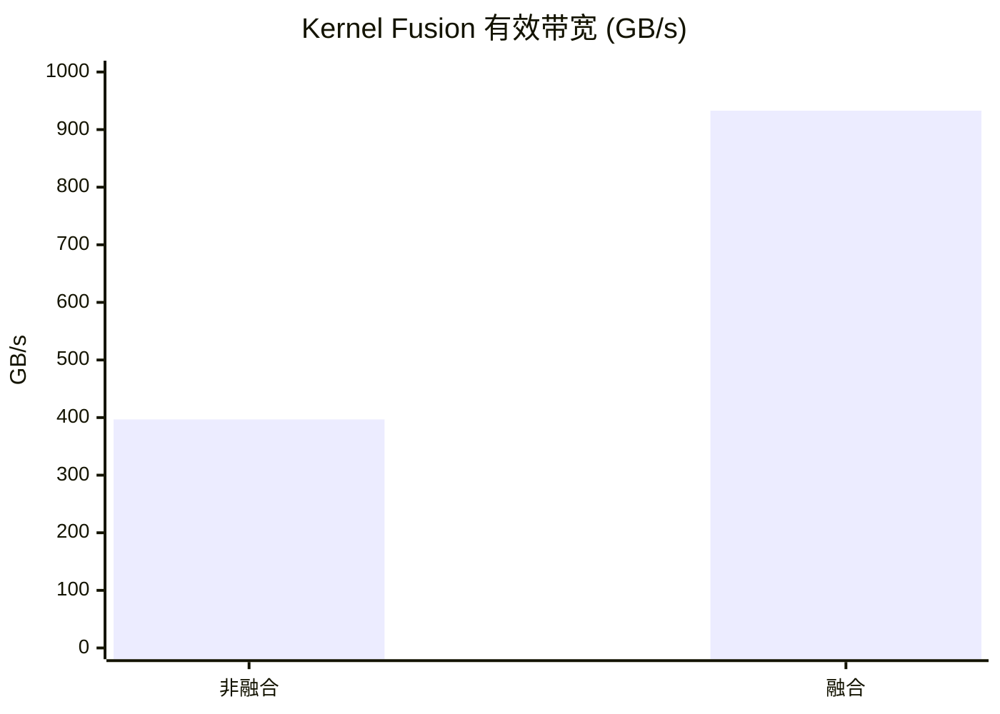

## 本文目标

读完本文，你将能够：

- 理解 LLM Decoding 阶段为何从 GEMM 退化为 GEMV / Gather，在 Roofline 下变成典型的 Memory Bound（乃至 Capacity Bound）
- 用一条最小链路「Add → ReLU → Scale」看清中间变量落盘如何吞噬带宽，并用 Kernel Fusion 把有效带宽推到接近硬件极限
- 理解 KV Cache 的两类瓶颈：**吞吐**（读写模式）与 **容量**（碎片/预留），掌握 PagedAttention 用分页块表换容量的寻址逻辑
- 理解 Continuous Batching 的核心：让显存与计算量随真实 token 数增长，用 Packed Tensor + `seq_starts` 消除 Padding 的存储与无效计算

## 对应代码路径

> **硬件环境**：NVIDIA RTX 4090 (Ada Lovelace, sm_89)
> 128 SMs | FP32 82.6 TFLOPS | HBM 1008 GB/s | L2 72 MB | Roofline 拐点 81.9 FLOP/Byte

| 源文件 | Kernel 名称 | 核心技术 | 测试规模 |
|--------|-------------|----------|----------|
| `11_Inference_Optimization/02_kernel_fusion/kernel_fusion.cu` | `add_kernel`、`relu_kernel`、`scale_kernel`、`fused_add_relu_scale` | 算子融合 (Kernel Fusion) | N = 134,217,728 |
| `11_Inference_Optimization/01_kv_cache/kv_cache.cu` | `naive_attention_kernel`、`paged_attention_kernel` | 分页 KV Cache (PagedAttention) | batch=32，max_seq=2048，block_size=16 |
| `11_Inference_Optimization/03_dynamic_batching/dynamic_batching.cu` | `batched_attention_fixed`、`batched_attention_varlen` | Continuous Batching（Packed Tensor） | batch=128，max_seq=1024 |

> 本篇承接 [05 大模型算子与注意力归一化](/posts/cb29461c/)、[07 量化半精度与整数推理](/posts/ef325d2f/)、[10 访存优化与共享内存冲突](/posts/5b6f891d/) 的单算子优化，站在 **LLM 推理系统** 视角：当单算子已足够快时，如何通过 KV Cache 管理、算子融合与批处理策略把服务端吞吐与并发拉满。后续 [08 多流图执行与扩展开发](/posts/b1c0c6a3/) 的 Multi-Stream / CUDA Graphs、[15 多卡通信与全归约](/posts/b599e19f/) 的跨卡通信，会把这些内核与系统优化扩展到多流、多卡。

---

## 三个实现分别做了什么

### 1. Kernel Fusion：把「中间变量落盘」从 7 次访存压到 3 次

`kernel_fusion.cu` 构造了一条最小但典型的推理链路：**Add → ReLU → Scale**。

非融合版本需要三次 Kernel 调用，每一步都把中间结果写回 Global Memory：

- Add：读 A、读 B、写 T1
- ReLU：读 T1、写 T2
- Scale：读 T2、写 O

合计 **读 4 次 + 写 3 次**，共 7 次全局访存。融合版本 `fused_add_relu_scale` 把三步串在一个 Kernel 内：`sum`、`activated` 留在寄存器，最终只写回一次 Output，合计 **读 2 次 + 写 1 次**。

它的价值在于建立一个**中间落盘吞噬带宽**的对照——在 Memory Bound 链路上，减少 round-trip 直接转化为有效带宽与耗时提升。

```cpp
// 来源：11_Inference_Optimization/02_kernel_fusion/kernel_fusion.cu : L9-L55
__global__ void add_kernel(CPFloat a, CPFloat b, PFloat output, CInt n) {
    int idx = blockIdx.x * blockDim.x + threadIdx.x;
    if (idx < n) {
        output[idx] = a[idx] + b[idx];
    }
}

__global__ void relu_kernel(CPFloat input, PFloat output, CInt n) {
    int idx = blockIdx.x * blockDim.x + threadIdx.x;
    if (idx < n) {
        output[idx] = fmaxf(input[idx], 0.0f);
    }
}

__global__ void scale_kernel(CPFloat input, PFloat output, CFloat scale, CInt n) {
    int idx = blockIdx.x * blockDim.x + threadIdx.x;
    if (idx < n) {
        output[idx] = input[idx] * scale;
    }
}

__global__ void fused_add_relu_scale(CPFloat a, CPFloat b, PFloat output,
                                    CFloat scale, CInt n) {
    int idx = blockIdx.x * blockDim.x + threadIdx.x;
    if (idx < n) {
        float sum = a[idx] + b[idx];
        float activated = fmaxf(sum, 0.0f);
        output[idx] = activated * scale;
    }
}
```

Block 配置为 256 或 1024 线程（依实现），Grid 覆盖全部 N 元素。融合版将有效带宽从约 397 GB/s 提升至约 933 GB/s [实测]，接近 RTX 4090 理论 1008 GB/s。

### 2. Naive KV Cache vs PagedAttention：用「查表」换容量

`kv_cache.cu` 用简化 Attention 访问模式代表 Decoding 阶段的核心访存：对每个 token 读 K/V 并做轻量计算（本实现用 `acc += (q*k)*v` 示意）。

- **naive_attention_kernel**：KV Cache 按 `[batch, head, max_seq_len, head_dim]` 连续存放。寻址简单、读访问易合并；代价是按 `max_seq_len` 预留连续空间，短请求产生大量内部碎片。
- **paged_attention_kernel**：将 KV 切成定长块（block_size=16 token），每序列持有一个 `block_table`，把「逻辑块号 → 物理块号」映射；Kernel 内层循环做整除/取模与指针解引用，把逻辑 token 位置翻译到分散的物理块。

分页会让读访问更碎、吞吐略降；但显著降低预留与碎片，提升并发上限。

### 3. Static Padding vs Continuous Batching：把 token 维度「压扁」

`dynamic_batching.cu` 对比两种批处理：

- **batched_attention_fixed**：按 `max_seq_len` 组织张量，短序列用 Padding 对齐；Kernel 内用 `if (i < actual_len)` 跳过 padding 部分计算。
- **batched_attention_varlen**：把所有序列的有效 token 拼成 Packed Tensor：key/value 的第一维是 `total_tokens`；每条序列用 `seq_starts` 给出 `[start, end)`，Kernel 只遍历真实 token 区间。

优化目标首先是**显存与系统吞吐**随真实 token 数线性增长，而不是被最大长度绑死；kernel 时间是否更快取决于 fixed 方案是否已用分支跳过 padding。

---

## Baseline 与瓶颈分析

### Decoding 为何天然 Memory Bound / Capacity Bound

自回归 Decoding 每步只产出 1 个 token：大量算子从「矩阵乘矩阵（GEMM）」退化为「矩阵乘向量（GEMV）/ Gather + 逐元素」，算术强度大幅下降。在 Roofline 下：

$$I = \frac{\text{FLOPs}}{\text{Bytes}} \quad \Rightarrow \quad P \approx I \times BW \quad [\text{Memory Bound}]$$

即更接近带宽天花板而非算力天花板。更进一步，KV Cache 还会出现 **Capacity Bound**：不是带宽不够，而是必须按最大长度预留，导致可服务并发被显存碎片与预留直接限制。

### 三类瓶颈与对应工程手段

| 瓶颈类型 | 表现 | 工程手段 |
|----------|------|----------|
| **带宽瓶颈（无效 round-trip）** | 非融合链路反复把中间变量写回 HBM，业务有效带宽远低于物理带宽 | Kernel Fusion：把多次访存压成一次读入、一次写回 |
| **容量瓶颈（KV 碎片/预留）** | 连续 KV 按 max_seq_len 预留，短请求浪费巨大 | PagedAttention：分块映射，逻辑→物理查表，以吞吐税换容量 |
| **Padding 瓶颈（死算与死存）** | 静态对齐把 batch 绑到最长序列，显存与循环随 max_len 增长 | Continuous Batching：Packed Tensor + seq_starts，只遍历有效 token |

---

## 优化思路：融合、分页与连续批处理如何落地

### 核心思想

- **Kernel Fusion**：把多次 Kernel 调度与中间落盘合并为一次 Kernel，把「必需搬运」从 7 次访存压到 3 次（读 A、读 B、写 O）。
- **PagedAttention**：允许 KV Cache 在物理显存上不连续，用 `block_table` + 块指针数组把逻辑 token 位置翻译到物理块，以吞吐税换容量与并发。
- **Continuous Batching**：把有效 token 压成 1D packed 维度，用 `seq_starts` 描述边界，避免 Padding 参与任何存储与计算。

### 访存量对比（Kernel Fusion）

设每元素为 float（4 B），链路 Add → ReLU → Scale：

| 版本 | 读次数 | 写次数 | 总访存（每元素） | 相对比例 |
|------|--------|--------|------------------|----------|
| 非融合 | 4（A, B, T1, T2） | 3（T1, T2, O） | $7 \times 4\text{ B}$ | 1.00 |
| 融合 | 2（A, B） | 1（O） | $3 \times 4\text{ B}$ | 3/7 |

理论访存降至约 **3/7**，有效带宽可逼近单次「读 2 写 1」的物理带宽上限 [实测]。

---

## 关键代码解释

### 融合 Kernel 的寄存器流水

融合版中，每线程只做三次标量运算，中间结果不写回 Global Memory：

```cpp
// 来源：11_Inference_Optimization/02_kernel_fusion/kernel_fusion.cu : L45-L54
float sum = a[idx] + b[idx];
float activated = fmaxf(sum, 0.0f);
output[idx] = activated * scale;
```

`sum`、`activated` 留在寄存器，只有最终结果写回。同一 Warp 内 `idx` 连续，读 A/B、写 O 均为合并访存，与 [01 基础概念与分块](/posts/7608f1b0/) 的 Vector Add 一致。

### PagedAttention 的「逻辑 → 物理」寻址

```cpp
// 来源：11_Inference_Optimization/01_kv_cache/kv_cache.cu : L73-L94
for (int i = 0; i < seq_len; ++i) {
    int logical_block_idx = i / block_size;
    int block_offset = i % block_size;

    int physical_block_idx = block_table[batch_idx * max_blocks_per_seq + logical_block_idx];

    float* k_block = k_blocks[physical_block_idx];
    float* v_block = v_blocks[physical_block_idx];

    int element_idx = head_idx * (block_size * head_dim) + block_offset * head_dim + tid;
    float k_val = k_block[element_idx];
    float v_val = v_block[element_idx];

    acc += (q_val * k_val) * v_val;
}
```

寻址链：**整除/取模 → 查 block_table → 指针解引用 → 块内偏移**。访问更碎、合并更困难，吞吐会下降；但 KV 从「必须连续」变为「按需分块」，从根上缓解碎片与预留。

### Block / Thread 映射（KV Cache Kernel）

| 层级 | 配置 | 职责 |
|------|------|------|
| Grid | `batch_size * num_heads` 个 Block | 每个 Block 负责一个 (batch, head) 的 Attention 输出 |
| Block | 1D，`head_dim` 线程 | 每线程负责 head_dim 的一维，沿 seq_len 循环读 K/V 并累加 |
| Thread `tid` | — | 取 Q 的一维、按逻辑/物理块取 K/V 对应元素，写回 output 的一维 |

### Continuous Batching 的 seq_starts 切分

```cpp
// 来源：11_Inference_Optimization/03_dynamic_batching/dynamic_batching.cu : L68-L86
int start_token_idx = seq_starts[batch_idx];
int end_token_idx = seq_starts[batch_idx + 1];

for (int token_idx = start_token_idx; token_idx < end_token_idx; ++token_idx) {
    int kv_idx = token_idx * (num_heads * head_dim) + head_idx * head_dim + tid;
    float k_val = key[kv_idx];
    float v_val = value[kv_idx];
    acc += (q_val * k_val) * v_val;
}
```

Packed Tensor 下 `token_idx` 维度无空洞。Kernel 不再需要「跑满 max_seq_len 再用 if 掩码」；即便 fixed 方案在计算上可跳过 padding，仍会在系统层为 padding 预留显存与调度，packed 方案把这部分开销消除。

### 数据流总览（推理链路三层优化）



---

## 结果与边界

### Kernel Fusion 性能（N = 134,217,728，50 次迭代取平均）

> 数据来源：`Results/11_Inference_Optimization.md` 原始日志

| 版本 | Kernel 耗时 | 有效带宽 | vs 非融合 | 数据性质 |
|------|------------|---------|----------|----------|
| 非融合序列 (Add+ReLU+Scale) | 4.06 ms | 396.79 GB/s | 1.00x | [实测] |
| **Fused Kernel** | **1.73 ms** | **932.85 GB/s** | **2.35x** | [实测] |

总搬运量（融合版）= $3 \times 134{,}217{,}728 \times 4 \text{ B} \approx 1.5 \text{ GB}$ [理论]。有效带宽 932.85 GB/s 达到 RTX 4090 理论 1008 GB/s 的 **92.5%** [实测/理论]，说明该 Kernel 已接近显存带宽物理极限。



### PagedAttention：吞吐税换容量（batch=32，max_seq=2048，block=16）

> 数据来源：`Results/11_Inference_Optimization.md` 原始日志

| 版本 | Kernel 耗时 | 等效带宽 | KV Cache 预估占用 | 数据性质 |
|------|------------|---------|------------------|----------|
| Naive 连续 KV | 0.37 ms | 898.12 GB/s | 512.00 MB | [实测] |
| **PagedAttention** | **0.45 ms** | **735.04 GB/s** | **317.75 MB** | [实测] |

PagedAttention 让 kernel 慢约 1.22x，但显存节省 **37.94%** [实测]。在推理服务中，这往往能把并发上限抬高一档。

### Continuous Batching：显存与并发（batch=128，max_seq=1024）

> 数据来源：`Results/11_Inference_Optimization.md` 原始日志

| 版本 | Kernel 耗时 | 有效带宽 | KV 相关显存（估算） | 数据性质 |
|------|------------|---------|---------------------|----------|
| Static Padding | 1.52 ms | 844.78 GB/s | 4096.00 MB | [实测] |
| **Varlen Packed** | **1.69 ms** | **759.09 GB/s** | **1311.22 MB** | [实测] |

两者 kernel 时间接近（static 已用分支跳过 padding），但 packed 把显存从 4096 MB 降到 1311 MB，节省 **67.99%** [实测]，等效可多服务约 **3.1x** 并发请求。

### 边界与局限

- **端到端视角**：本篇侧重系统吞吐与容量，因此 Paged、Varlen 在单 kernel 指标上可能更慢，但在服务并发与长尾长度分布下收益更大。
- **H2D/D2H**：实测中 H2D/D2H 常远大于 kernel，属基准测试方式（每次搬大张量）。真实推理通常权重与 KV 常驻显存，并用多流/图执行减少调度。
- **CUDA Graph 与动态形状**：Paged 与 Varlen 更动态，与完全静态的图模板有张力；工程上常用多模板 + 分桶（bucket）折中。

---

## 常见误区

1. **误区**：推理慢就去看 TFLOPS / `sm__throughput`，认为「算力不够」。
   **实际**：Decoding 阶段更常见的是 `dram__throughput`、访存模式与 KV 容量成为主瓶颈；先消除无效搬运、碎片与 padding，收益通常远大于再挤算力。

2. **误区**：Kernel Fusion 只是「少一次 kernel launch」，收益有限。
   **实际**：更大收益来自「少写两份中间张量回 HBM」。在 Memory Bound 链路上，减少 round-trip 直接体现在带宽与耗时上（本实测 2.35x）。

3. **误区**：PagedAttention 变慢说明「不值得用」。
   **实际**：PagedAttention 解决的是 Capacity Bound：在显存紧张、长尾长度分布下，节省的 KV 空间能显著提高并发；吞吐税是为了换容量。

4. **误区**：Continuous Batching 的目标是让 kernel 更快。
   **实际**：它首先是「让显存与计算量跟真实 token 数走」，从系统层消灭 padding 带来的死存；kernel 时间是否更快取决于 fixed 方案是否已用分支跳过。

---

## 系列导航

### 前置阅读

| 文章 | 与本篇的衔接 |
|------|----------------|
| [01 基础概念与分块](/posts/7608f1b0/) | 建立合并访存、Shared Tiling 与带宽墙直觉；本篇 Fusion 的「读 2 写 1」与 01 的 Vector Add 同属带宽压榨 |
| [05 大模型算子与注意力归一化](/posts/cb29461c/) | 单次自注意力 / Norm / FlashAttention 的算子级优化；本篇讨论这些算子在推理系统中的部署与 KV 管理 |
| [10 访存优化与共享内存冲突](/posts/5b6f891d/) | 合并访存与 Bank 优化；本篇 Kernel Fusion、PagedAttention、Continuous Batching 都依赖良好的 Global 访存与合理 Shared 使用 |

### 推荐后续（承上启下）

| 文章 | 与本篇的衔接 |
|------|----------------|
| [08 多流图执行与扩展开发](/posts/b1c0c6a3/) | 将本篇的推理算子与 KV Cache 放入多流和 CUDA Graphs 的系统级调度 |
| [13 性能分析、屋顶线与占用率](/posts/803b94d6/) | 用 Nsight 与 Roofline 判断 Memory Bound / Capacity Bound，验证本篇优化效果 |
| [15 多卡通信与全归约](/posts/b599e19f/) | 在多卡环境下扩展本篇思路，从单卡推理到多卡分布式推理 |

---

## 顺序导航

- 上一篇：[CUDA实践-10-访存优化与共享内存冲突](/posts/5b6f891d/)
- 下一篇：[CUDA实践-12-标准库与工程实践](/posts/a1e20e80/)
