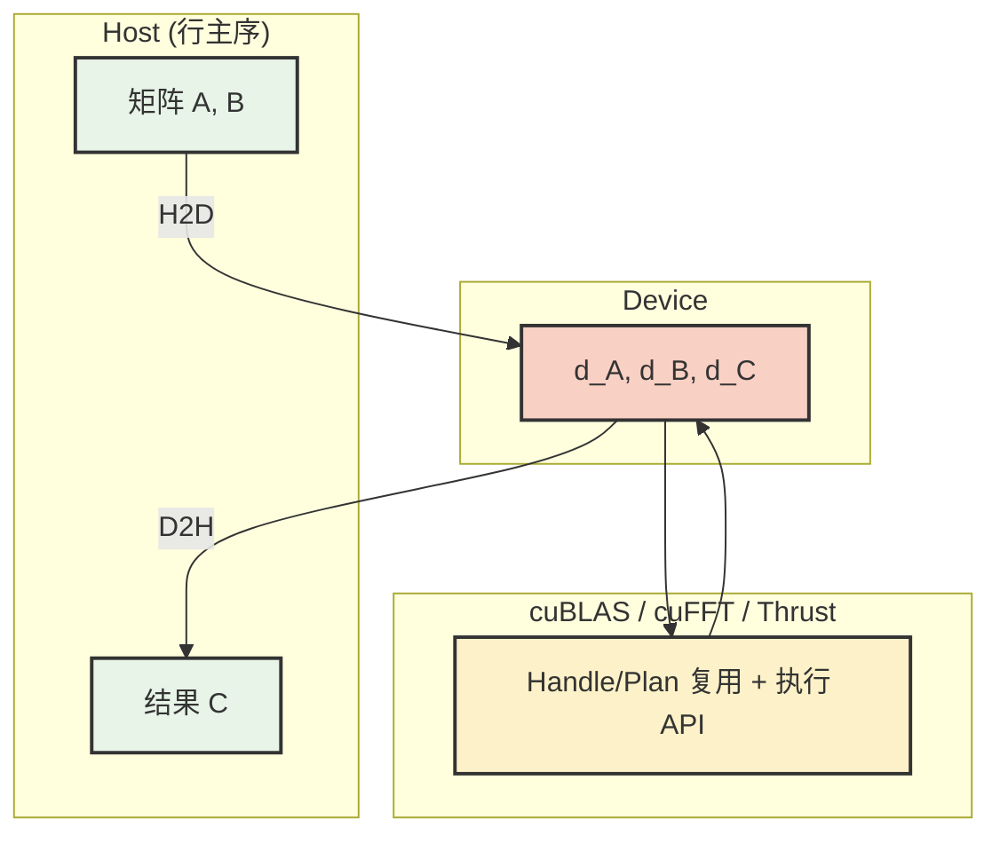
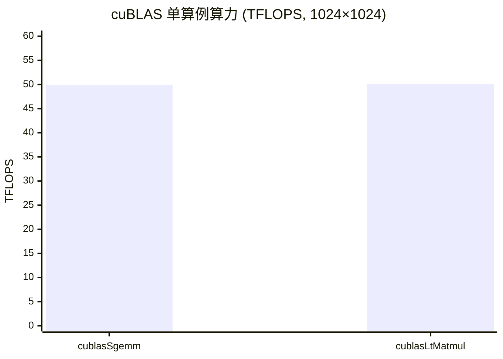

## 本文目标

读完本文，你将能够：

- 建立「**库是性能天花板基准**」的直觉：学会用 cuBLAS / cuFFT / Thrust 作为对照，判断一个算子应该继续手写优化，还是该直接调库
- 理解 cuBLAS 的**列主序**约定，并用转置等律 $C^T = B^T A^T$ **零拷贝**对接 C/C++ 行主序数据
- 把握“库外成本”的主要来源：避免在循环内重复创建 `cublasHandle_t` / `cufftHandle`，用批处理接口（cuBLAS StridedBatched、cuFFT PlanMany）**摊薄启动开销**
- 理解 cuFFT 的两类工作负载：**小 FFT 受启动与计划影响**，大批量 FFT 受带宽限制；并理解 CPU $O(N^2)$ DFT 与 GPU $O(N\log N)$ FFT 的“加速比不可比”
- 正确使用 Thrust：在热路径中用 `cudaMalloc` + `thrust::device_ptr` + `thrust::cuda::par.on(stream)` 避免隐式分配与默认流同步，能与多流/流水线共存
- 形成一套可复用的 CUDA 工程骨架：计时、校验、资源生命周期（RAII）、流语义与错误处理的“最低配最佳实践”

## 对应代码路径

> **硬件环境**：NVIDIA RTX 4090 (Ada Lovelace, sm_89)
> 128 SMs | FP32 82.6 TFLOPS | HBM 1008 GB/s | L2 72 MB | Roofline 拐点 81.9 FLOP/Byte

| 源文件 | Kernel / 接口 | 核心技术 | 测试规模 |
|--------|---------------|----------|----------|
| `12_Standard_Libraries/01_cublas_gemm/cublas_gemm.cu` | `cublasSgemm` / `cublasLtMatmul` / `cublasSgemmStridedBatched` | cuBLAS GEMM、行主序对接、批处理 | M=N=K=1024，Batch=8 |
| `12_Standard_Libraries/02_cufft/cufft_example.cu` | `cufftExecC2C`、`normalize_complex_kernel` | cuFFT 1D C2C、Batched 规划 | N=4096 单次；Batch=65536×1024 |
| `12_Standard_Libraries/03_thrust/thrust_algorithms.cu` | `thrust::sort` / `thrust::reduce` / `thrust::transform` | Thrust 排序、归约、变换 | N=10,000,000 (38.15 MB) |

> 本篇承接 [04 矩阵乘优化与寄存器分块](/posts/1a09f6f/) 与 [09 张量核心与混合精度](/posts/78e375e8/) 对「手写 GEMM 极限」的探索，给出工业界**性能上限基准**——cuBLAS / cuFFT / Thrust，帮助你判断「何时该自己写 Kernel、何时该调库」。后续 [14 模板矩阵乘与代数布局](/posts/f1b57921/) 展示如何在库与手写之间，用模板库生成接近 cuBLAS 的专用算子。

---

## 三个实现分别做了什么

### 1. cuBLAS GEMM：单算例与批处理

`cublas_gemm.cu` 的目标不是“教你写 GEMM”，而是给你一个**不可轻易超过的上限**：在同一块 GPU 上，手写 GEMM 能做到多少 TFLOPS，cuBLAS 能做到多少 TFLOPS？两者的差距告诉你下一步优化是否值得。

文件里给了三种调用路径：

- **基础路径**：`cublasSgemm`（最稳定、最常用的参考）
- **启发式路径**：`cublasLtMatmul`（让库自己在算法空间里选更合适的实现）
- **批处理路径**：`cublasSgemmStridedBatched`（同形状多矩阵一次调用完成，摊薄启动与调度开销）

工程上最容易踩的坑是主序：CPU 侧常见行主序（Row-Major），cuBLAS 默认列主序（Column-Major）。正确的“零拷贝对接”方法不是先转置再算，而是直接利用等律：

$$
C = A B \quad (\text{行主序}) \;\;\Longleftrightarrow\;\; C^T = B^T A^T \quad (\text{列主序视角})
$$

也就是把行主序内存里的 `B`、`A` **按库视角当作** $B^T$、$A^T$ 传入，让库算 $B^T A^T$，输出在物理布局上就对应行主序的 $C$。这个技巧能把“转置 Kernel + 一次额外读写”的库外成本完全省掉。

另外，Handle 是典型的“一次性重成本对象”。示例用 RAII（如 `CuBLASContext` / `CuBLASLtContext`）在程序生命周期里只创建一次，避免循环里反复 `cublasCreate`。

```cpp
// 来源：12_Standard_Libraries/01_cublas_gemm/cublas_gemm.cu : L110-L116
// 行主序 C = A*B 等价于 C^T = B^T * A^T，传 B、A 与尺寸 (N,M,K) 得到行主序 C
cublasSgemm(handle, CUBLAS_OP_N, CUBLAS_OP_N,
            N, M, K,
            &alpha,
            d_B, N,  // B 作为第一个矩阵（库视为列主序）
            d_A, K,  // A 作为第二个矩阵
            &beta,
            d_C, N); // 结果按行主序写回
```

单算例 M=N=K=1024 时 Kernel 约 0.04 ms，算力约 50 TFLOPS [实测]，接近 RTX 4090 FP32 峰值的六成。

### 2. cuFFT：1D C2C 与 Batched 吞吐

`cufft_example.cu` 做两件事：

- **验证与理解**：用 `cufftPlan1d` + `cufftExecC2C` 跑一个单次 1D C2C FFT（N=4096），并在 IFFT 后用自写 `normalize_complex_kernel` 做除以 $N$ 的归一化（cuFFT 的逆变换默认不做这一项）
- **吞吐基准**：用 `cufftPlanMany` 跑大批量（Batch=65536, N=1024，约 512 MB），用“搬运字节数 / 时间”估有效带宽，判断在真实工程里 FFT 更像 **Memory Bound**（大批量）还是更像 **启动/计划受限**（小批量）

它的价值在于建立**官方 FFT 库的吞吐基准**——CPU 参考为 $O(N^2)$ 的 DFT，仅用于正确性对比；与 GPU $O(N\log N)$ 的 cuFFT 在算法复杂度上不可直接比加速比。

```cpp
// 来源：12_Standard_Libraries/02_cufft/cufft_example.cu : L32-L39
void create_plan(int size) {
    n = size;
    cufftPlan1d(&plan, n, CUFFT_C2C, 1);
}
void forward(cufftComplex* input, cufftComplex* output) {
    cufftExecC2C(plan, input, output, CUFFT_FORWARD);
}
```

单次 N=4096 时 GPU 约 0.0035 ms，100 次平均；Batched 65536×1024 时约 1.17 ms/批，有效带宽约 457 GB/s [实测]。

### 3. Thrust：排序、归约与变换

`thrust_algorithms.cu` 对 1000 万元素（38.15 MB float）做 **Sort**（`thrust::sort`）、**Reduce**（`thrust::reduce` 求和）、**Transform**（SAXPY：$y \gets a x + y$，用 `saxpy_functor`）。计时区分 H2D/Kernel/D2H。Reduce / Transform 用「读+写」字节数除以时间得到有效带宽，与 RTX 4090 理论带宽对比。

这部分的重点同样不是“语法”，而是工程语义：Thrust 很容易让你在不自知的情况下引入两类库外成本：

- **隐式分配/释放**：`thrust::device_vector` 的构造/析构触发显存分配，放在循环里会把热路径拖垮
- **隐式同步**：Thrust 默认绑定 default stream，和你自己的多流/异步传输混用时，常常出现“看起来没写同步但就是不并行”的问题

因此本文将 `device_vector` 仅作为“最短可运行示例”，并在后文给出生产更常用的：裸指针 + 指定 stream 的写法。

```cpp
// 来源：12_Standard_Libraries/03_thrust/thrust_algorithms.cu : L150-L158, L173
struct saxpy_functor {
    const float a;
    saxpy_functor(float _a) : a(_a) {}
    __host__ __device__
    float operator()(const float& x, const float& y) const { return a * x + y; }
};
// ...
thrust::transform(d_x.begin(), d_x.end(), d_y.begin(), d_out.begin(), saxpy_functor(a));
```

---

## Baseline 与瓶颈分析

### 统一视角：你真正要优化的是“端到端”而不是某个 Kernel

在工程里，“调库”之所以会比手写快，并不神秘：库把大量细节做到了极致（算法选择、pipeline、tensor core、访存布局、launch 配置等）。但你能否享受到这些优势，取决于你是否把**库外成本**控制住——否则你优化的是库内微秒级 Kernel，却被库外毫秒级初始化/同步吞掉。

这一节把三个最常见的“库外瓶颈”定性成可检查的清单：

1. **主序/布局不匹配**：行主序数据直接按列主序传入 → 结果错；先转置再调库 → 多一次整矩阵读写与一次 Kernel 启动
2. **Handle/Plan 生命周期错误**：把 `cublasCreate` / `cufftPlan*` 放进循环里 → 初始化成本远大于执行成本
3. **默认流与隐式同步**：Thrust / 部分库 API 默认用 default stream → 与多流 pipeline 混用时被迫串行

其中第 1 条可以用数学等价关系“零成本修复”，第 2 条和第 3 条属于工程纪律：**把重对象上移到初始化，把执行 API 放进循环，把 stream 显式化**。

### CPU 参考基线（仅用于正确性与量级感受）

> 数据来源：`Results/12_Standard_Libraries.md` 原始日志

| Baseline 类别 | 测试场景 | 指标 | 值 | 数据性质 |
|---------------|----------|------|-----|----------|
| CPU DFT | N=4096 | 完整计算时间 | 395.08 ms | [实测] |
| CPU std::sort | N=10M float | 排序总时间 | 2124.06 ms | [实测] |
| CPU std::accumulate | N=10M | 归约总时间 | 28.35 ms | [实测] |

cuBLAS 在 M=N=K=1024 时未跑 CPU 参考（避免过长等待），日志中「CPU 单算例 0.00 ms / 加速比 0.00x」为占位，仅表示未测。

### “小算例很快但线上很慢”的常见来源

把问题说得更直白一些：如果你的线上 workload 是“每次只算很小一块，但要算很多次”，那么它通常不是 Compute Bound，而是被以下几类延迟主导：

- **创建/销毁**：`cublasCreate` / `cufftPlan` / `device_vector` 构造析构
- **同步**：默认流、隐式 `cudaDeviceSynchronize`、Host 侧等待
- **启动开销**：大量小 Kernel / 小 FFT 的频繁 launch

解决路线也对应三类手段：复用（handle/plan）、批处理（batched API）、流化（显式 stream 与 pipeline）。

---

## 优化思路：转置等律、Handle 复用与 Thrust 流如何落地

### 核心思想

- **行主序对接 cuBLAS（零拷贝）**：利用 $C^T = B^T A^T$。不搬移 $A,B$，不写转置 kernel，只调整传参顺序与维度 `(N, M, K)`。
- **Handle/Plan 只建一次（把毫秒从循环里挪出去）**：初始化阶段创建 `cublasHandle_t` / `cufftHandle`，循环内只调用执行 API。
- **批处理摊薄启动（把很多小调用合成一次大调用）**：同形状多矩阵用 cuBLAS StridedBatched；多路 FFT 用 cuFFT PlanMany。
- **Thrust 显式 stream（让它成为 pipeline 的一员）**：裸指针 + `thrust::device_ptr` + `thrust::cuda::par.on(stream)`，避免默认流引入的串行化。

### 调用方式对比（cuBLAS）

| 调用方式 | 维度/规模 | 典型用途 | 单次启动成本 |
|----------|------------|----------|--------------|
| cublasSgemm | 单组 (M,N,K) | 单矩阵乘 | 一次 Kernel 启动 |
| cublasLtMatmul | 单组，启发式选算法 | 单矩阵乘、自动选 kernel | 一次 Kernel 启动 |
| cublasSgemmStridedBatched | 多组，stride 对齐 | 同形状多矩阵 | 一次调用多组，摊薄启动 |

---

## 关键代码解释

### cuBLAS 行主序对接：传参顺序与维度

```cpp
// 来源：12_Standard_Libraries/01_cublas_gemm/cublas_gemm.cu : L111-L116
// 目标：CPU 侧行主序 A、B，求行主序 C = A*B。利用 C^T = B^T * A^T，传 B、A 与 (N,M,K)
cublasSgemm(handle, CUBLAS_OP_N, CUBLAS_OP_N,
            N, M, K,
            &alpha,
            d_B, N,   // ldb=N：行主序 B 的「列」连续，库按列主序读即视为 B^T
            d_A, K,   // lda=K：行主序 A 的列宽为 K
            &beta,
            d_C, N);  // ldc=N：输出列主序即 C^T，物理布局等价于行主序 C
```

要点：不传 A、B 而传 B、A，并把维度从 (M, N, K) 改为 (N, M, K)，使库计算的「列主序下的 B^T·A^T」在内存布局上正好对应行主序的 C。许多推理/训练框架在封装 cuBLAS 时都采用这类等价调用。

### Handle 与 StridedBatched 调用

Handle 在进程或模块内只创建一次（示例中由 `CuBLASContext` 在 main 开头构造）。批处理时用 `cublasSgemmStridedBatched` 一次传入多组矩阵的首指针与 stride：

```cpp
// 来源：12_Standard_Libraries/01_cublas_gemm/cublas_gemm.cu : L171-L179
cublasSgemmStridedBatched(handle, CUBLAS_OP_N, CUBLAS_OP_N,
                          N, M, K, &alpha,
                          d_B, N, strideB, d_A, K, strideA, &beta,
                          d_C, N, strideC, batch_size);
```

### cuFFT：PlanMany 把“很多次小 FFT”变成“一次可控的批处理”

cuFFT 的 plan 是重对象。把 plan 放到循环外复用，是第一层收益；把 workload 组织成批处理（PlanMany），是第二层收益——它把大量小调用合并成更少的 launch，让启动与调度开销被摊薄。

对工程而言，PlanMany 的关键不是 API 形式，而是你要把数据布局描述清楚：每个信号长度、batch 数量、stride/dist 等。只要你把“这一批数据在内存里怎么排”说清楚，库就能更高效地执行。

### Thrust：裸指针 + 指定流（推荐写法）

热路径或需与多流并行的代码中，避免在循环内使用 `thrust::device_vector`。推荐：`cudaMalloc` 分配，`thrust::device_ptr` 包装，`thrust::cuda::par.on(stream)` 指定执行流：

```cpp
// 推荐模式（与本仓库 03_thrust 示例逻辑一致，用于集成到多流/推理管线）
float* d_raw;
cudaMalloc(&d_raw, N * sizeof(float));
// ... 填充 d_raw ...

thrust::device_ptr<float> d_ptr(d_raw);
thrust::sort(thrust::cuda::par.on(my_stream), d_ptr, d_ptr + N);
// 或 thrust::reduce(thrust::cuda::par.on(my_stream), d_ptr, d_ptr + N);

cudaFree(d_raw);
```

这样 Thrust 算法与同 stream 上的其他 Kernel/传输可正确重叠，且无额外隐式分配。

### 调用层级与职责（把“该放哪”说清楚）

| 层级 | 职责 |
|------|------|
| Handle / Plan | 程序或模块内只创建一次，封装库状态与 workspace |
| 执行 API（Sgemm / ExecC2C / sort/reduce/transform） | 循环内反复调用，仅传数据指针与维度 |
| 批处理 API（StridedBatched / PlanMany） | 同形状多组数据一次调用，摊薄启动开销 |

### 一套最低配的 CUDA 工程实践清单（与本项目写法对齐）

下面这份清单是“你写任何 CUDA 小项目/benchmark 都该有的骨架”，本仓库的写法也围绕这些点展开：

| 实践项 | 为什么重要 | 常见错误 |
|------|------------|----------|
| `cudaEvent` 计时 + warmup | 分离 kernel 时间与一次性开销；避免首轮 JIT/缓存抖动 | 用 `std::chrono` 直接夹住 kernel；不 warmup |
| 错误检查宏/封装 | `cudaGetLastError` / 返回码不查会让错误延后爆炸 | 只看最后一次 API，漏掉前面的错误 |
| RAII 管理重对象 | `cublasHandle` / `cufftHandle` / event / stream 都应明确生命周期 | 在循环里 create/destroy |
| 显式 stream 语义 | 让库调用融入 pipeline；避免默认流把并行变串行 | 多流代码里夹杂 default stream 的库调用 |
| 正确性校验与容差 | 库/手写混合时先把“对不对”解决，再谈“快不快” | 只看速度，不看误差；对浮点用严格相等 |

这也是为什么本文反复强调“库外成本”：**你把骨架搭对了，库才会真的快**。

### 数据流总览（标准库在推理/训练中的位置）



---

## 结果与边界

### cuBLAS GEMM（M=N=K=1024，50 次迭代取平均）

> 数据来源：`Results/12_Standard_Libraries.md` 原始日志

| 版本 | Kernel 耗时 | 计算吞吐 (TFLOPS) | vs 理论峰值 | 数据性质 |
|------|-------------|-------------------|-------------|----------|
| cublasSgemm | 0.04 ms | **49.91** | 约 60% | [实测] |
| cublasLtMatmul | 0.04 ms | **50.10** | 约 61% | [实测] |
| StridedBatched (Batch=8) | 0.45 ms（8 矩阵合计） | 37.88（批总吞吐） | — | [实测] |

RTX 4090 FP32 理论峰值约 82.58 TFLOPS。cuBLAS 单算例已达约 50 TFLOPS，手写优化 GEMM（如 [04 矩阵乘优化与寄存器分块](/posts/1a09f6f/)）约达其一半量级。日志中 M=N=K=1024 时 CPU 参考被跳过，故「CPU 0.00 ms / 加速比 0.00x」为占位，非真实对比。



### cuFFT（N=4096 单次；Batch=65536、N=1024 吞吐）

> 数据来源：`Results/12_Standard_Libraries.md` 原始日志

| 版本 | 耗时 | 备注 | 数据性质 |
|------|------|------|----------|
| CPU DFT ($O(N^2)$) | 395.08 ms | N=4096 | [实测] |
| GPU cuFFT 1D Forward | 0.0035 ms | 100 次平均 | [实测] |
| GPU Batched (65536×1024) | 1.17 ms/批 | 有效带宽约 457.46 GB/s | [实测] |

CPU 与 GPU 算法复杂度不同（DFT 与 FFT），加速比仅作量级感受。大批量 FFT 的有效带宽说明在访存受限场景下 cuFFT 仍能压榨较高吞吐。

### Thrust（N=10,000,000，Sort 5 次 / Reduce·Transform 100 次取平均）

> 数据来源：`Results/12_Standard_Libraries.md` 原始日志

| 操作 | GPU Kernel 耗时 | 有效带宽 | vs CPU 加速比 | 数据性质 |
|------|-----------------|----------|---------------|----------|
| thrust::sort | 1.30 ms | — | **1634x** | [实测] |
| thrust::reduce | 0.08 ms | **487.88 GB/s** | **371x** | [实测] |
| thrust::transform (SAXPY) | 0.13 ms | **849.73 GB/s** | 222x | [实测] |

Reduce 带宽按读 38.15 MB 计；Transform 按读 X、读 Y、写结果共约 3×38.15 MB 计。有效带宽 849.73 GB/s 达到 RTX 4090 理论 1008 GB/s 的 **84.3%** [实测/理论]，说明该 Transform 已接近显存带宽物理极限。

### 边界与局限

- **黑盒与融合**：cuBLAS/cuFFT 为闭源库，无法在库内部插入自定义操作（如激活函数）。若需「GEMM + 激活」等融合算子，需使用 CUTLASS、CuTe 或自写 Kernel（见 [14 模板矩阵乘与代数布局](/posts/f1b57921/)）。
- **主序与 API**：所有涉及维度的 API（lda/ldb/ldc、Plan 的 stride/dist）都需按库文档的主序约定传参，否则结果错误或性能下降。
- **端到端瓶颈**：当数据频繁往返 CPU/GPU（H2D/D2H）时，即使库内算得再快，端到端仍可能被 PCIe/同步主导。评估时务必把“算子时间”和“数据运动时间”分开看。

---

## 常见误区

1. **误区**：调了官方库就一定能跑满性能。
   **实际**：性能损耗常出在「库外」：在循环或每帧内重复 `cublasCreate` / `cufftPlan1d` 等，单次可能数毫秒，会完全掩盖 Kernel 的微秒级耗时。Handle / Plan 应在程序或模块生命周期内只创建一次，在循环内只调用执行类 API。

2. **误区**：用 `thrust::device_vector` 既方便又安全，热路径多用无妨。
   **实际**：每次构造/析构都会触发显存分配/释放，且 Thrust 默认使用 default stream，容易引入隐式同步，破坏与多流、重叠传输的并行。热路径或需与多流并行的代码中，应用 `cudaMalloc` + `thrust::device_ptr`，并用 `thrust::cuda::par.on(stream)` 绑定到指定流。

3. **误区**：cuBLAS 结果和手写 CPU 矩阵乘对不上，一定是库有 bug。
   **实际**：先检查主序：cuBLAS 默认列主序，C/C++ 多为行主序。直接按行主序传 A、B 而不做等价变换，结果会错乱。用 $C^T = B^T A^T$ 的传参方式（传 B、A 与维度 N,M,K）即可零开销得到行主序 C。

4. **误区**：CPU DFT 与 GPU cuFFT 的加速比可以当作「算法公平对比」。
   **实际**：CPU 参考为 $O(N^2)$ DFT，GPU 为 $O(N\log N)$ FFT，算法复杂度不同，加速比仅用于感受量级与正确性验证；真正评估 cuFFT 应看大批量下的有效带宽与延迟。

5. **误区**：只要 Kernel 时间很短，整体就一定快。
   **实际**：很多工程慢在数据运动与同步。尤其是把库调用放进 default stream、或在每次调用后无脑 `cudaDeviceSynchronize()`，会把本可并行的流水线强行串行化。正确做法是把 stream 语义与同步点设计清楚，用事件或依赖而非“全局同步”。

---

## 系列导航

### 前置阅读

| 文章 | 与本篇的衔接 |
|------|----------------|
| [01 基础概念与分块](/posts/7608f1b0/) | 建立带宽墙、合并访存与 Tiling 直觉；本篇标准库是手写 Kernel 的性能天花板参照 |
| [04 矩阵乘优化与寄存器分块](/posts/1a09f6f/) | 手写 GEMM 的极限与约一半 cuBLAS 峰值，帮助理解 cuBLAS 50 TFLOPS 的量级 |
| [09 张量核心与混合精度](/posts/78e375e8/) | Tensor Core / 混合精度，与 cuBLAS 自动利用张量核心的工业实现对照 |

### 推荐后续（承上启下）

| 文章 | 与本篇的衔接 |
|------|----------------|
| [11 推理优化、融合与键值缓存](/posts/9729c03f/) | 推理系统中将 cuBLAS/cuFFT/Thrust 作为基础算子，与 Kernel Fusion、KV Cache、Batching 结合 |
| [13 性能分析、屋顶线与占用率](/posts/803b94d6/) | 用 Nsight 与 Roofline 量化标准库与手写 Kernel 的算力/带宽，验证本篇基准 |
| [14 模板矩阵乘与代数布局](/posts/f1b57921/) | 当标准库无法满足融合或特殊布局时，用 CUTLASS/CuTe 生成接近 cuBLAS 水平的专用内核 |

---

## 顺序导航

- 上一篇：[CUDA实践-11-推理优化融合与键值缓存](/posts/9729c03f/)
- 下一篇：[CUDA实践-13-性能分析屋顶线与占用率](/posts/803b94d6/)
