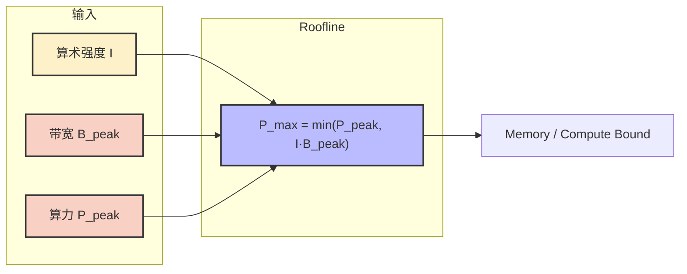
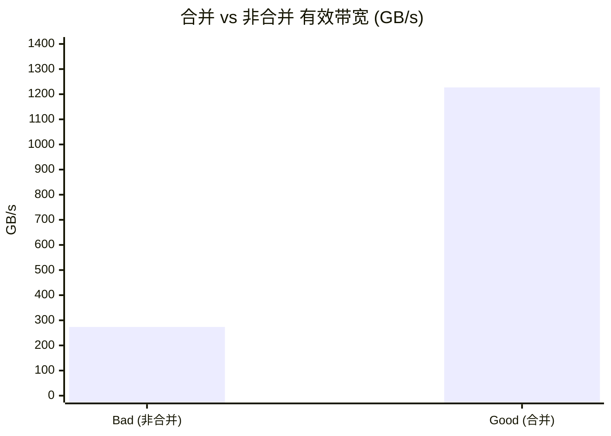

## 本文目标

读完本文，你将能够：

- 用 Roofline 模型定量判断一个 Kernel 是 Memory Bound 还是 Compute Bound，并算出「理论上限」与「当前效率」
- 理解 Occupancy 的真实含义：它是隐藏延迟的手段之一，而不是要无条件追求 100%；掌握 ILP 在带宽型算子中如何补足甚至超越高占用率
- 用 Nsight Compute / Nsight Systems 的关键指标，把「非合并 / 在等内存 / 在等指令」变成可复现的证据链
- 在「还可以快多少」与「到底卡在算力还是带宽」之间建立统一的诊断流程

## 对应代码路径

> **硬件环境**：NVIDIA RTX 4090 (Ada Lovelace, sm_89)
> 128 SMs | FP32 82.6 TFLOPS | HBM 1008 GB/s | L2 72 MB | Roofline 拐点 81.9 FLOP/Byte

| 源文件 | Kernel 名称 | 核心技术 | 测试规模 |
|--------|-------------|----------|----------|
| `13_Performance_Analysis/02_roofline/roofline.cu` | `memory_bound_kernel` / `compute_bound_kernel` | Roofline 双基准：Vector Add（Memory Bound）、Naive GEMM（Compute Bound） | N = 10,000,000 / N = 1024 |
| `13_Performance_Analysis/01_occupancy/occupancy.cu` | `configurable_kernel` / `shared_memory_kernel` / `register_limited_kernel` | Occupancy、ILP、SMEM/寄存器资源约束 | N = 10,000,000 |
| `13_Performance_Analysis/03_nsight_profiling/nsight_profiling.cu` | `profile_example_kernel_bad` / `profile_example_kernel_good` | 非合并访存 vs 合并访存探针 | N = 10,000,000 |

> 本篇在系列中的位置：承接 [01 基础概念与分块](/posts/7608f1b0/) 的带宽墙与 Roofline 直觉、[04 矩阵乘优化与寄存器分块](/posts/1a09f6f/) 与 [10 访存优化与共享内存冲突](/posts/5b6f891d/) 的具体优化，本篇抽象出统一的 **性能建模与诊断视角**——通过 Roofline / Occupancy / Nsight 回答「理论上限在哪」「当前卡在带宽还是算力」「占用率是否值得继续堆」。后续 [11 推理优化、融合与键值缓存](/posts/9729c03f/) 与 [12 标准库与工程实践](/posts/a1e20e80/) 会在推理系统与标准库层面复用这些方法。

---

## 三个实现分别做了什么

### 1. Roofline 双基准：用两个极端算子「定天花板」

`roofline.cu` 用两个刻意选取的 baseline 建立诊断坐标系：

- **memory_bound_kernel**：Vector Add，每元素读 $A$、读 $B$、写 $C$（12 字节），只做 1 次加法，最典型的 Memory Bound。
- **compute_bound_kernel**：Naive GEMM，算术强度高（理想化口径下 $I \gg$ 拐点），用于对照 Compute Bound 理论上限与实际效率。

它的价值在于：**跑一次就能从设备查询峰值算力与带宽，打印 Ridge Point（拐点算术强度），并给出每个 Kernel 的算术强度、理论上限、实测吞吐与效率**——把 [01](/posts/7608f1b0/) 里的 Roofline 直觉变成可执行的诊断脚本。

```cpp
// 来源：13_Performance_Analysis/02_roofline/roofline.cu : L12-L34
__global__ void memory_bound_kernel(CPFloat a, CPFloat b, PFloat c, CInt n) {
    int idx = blockIdx.x * blockDim.x + threadIdx.x;
    if (idx < n) {
        c[idx] = a[idx] + b[idx];
    }
}

__global__ void compute_bound_kernel(CPFloat A, CPFloat B, PFloat C, CInt N) {
    int row = blockIdx.y * blockDim.y + threadIdx.y;
    int col = blockIdx.x * blockDim.x + threadIdx.x;
    if (row < N && col < N) {
        float sum = 0.0f;
        for (int i = 0; i < N; ++i) {
            sum += A[row * N + i] * B[i * N + col];
        }
        C[row * N + col] = sum;
    }
}
```

运行时会从设备查询峰值算力与带宽，打印 Ridge Point，并对每个 Kernel 做 Roofline 分析（算术强度、瓶颈判定、理论峰值、实测 GFLOPS、效率百分比）。

### 2. Occupancy 与 ILP：用「同样总工作量」挑战占用率迷信

`occupancy.cu` 构造带宽型 kernel `configurable_kernel<BLOCK_SIZE, ITEMS_PER_THREAD>`：每线程处理 `ITEMS_PER_THREAD` 个元素，用 `#pragma unroll` 让加载指令形成 ILP。目标是回答：**当每线程干更多事（ILP 更高）时，即便 Block 更小、并发形态变化，性能会怎样？**

同时提供 `shared_memory_kernel`（每 Block 32 KB Shared Memory 挤占 SM 资源）与 `register_limited_kernel`（`__launch_bounds__` 限制寄存器）作为「资源约束」的对照，说明 Occupancy 受 SMEM/寄存器限制时的表现。

它的价值在于建立**延迟隐藏的多元视角**：Occupancy 不是唯一杠杆，在带宽型算子中 ILP 常能更充分地压榨带宽，甚至出现「低 Occupancy + 高 ILP」优于「满 Occupancy + 低 ILP」的情况。

```cpp
// 来源：13_Performance_Analysis/01_occupancy/occupancy.cu : L8-L24
template<int BLOCK_SIZE, int ITEMS_PER_THREAD>
__global__ void configurable_kernel(CPFloat input, PFloat output, CInt n) {
    float items[ITEMS_PER_THREAD];
    int base_idx = blockIdx.x * BLOCK_SIZE * ITEMS_PER_THREAD;

    #pragma unroll
    for (int i = 0; i < ITEMS_PER_THREAD; ++i) {
        int idx = base_idx + i * BLOCK_SIZE + threadIdx.x;
        if (idx < n) {
            items[i] = input[idx];
        } else {
            items[i] = 0.0f;
        }
    }
    // ... 处理与写回
}
```

`idx` 的构造保证同一 Warp 内相邻线程访问连续地址（合并访存）；每线程多元素 + `#pragma unroll` 形成 ILP，让加载流水线更饱和。

### 3. Nsight 探针：把「非合并」变成可量化证据

`nsight_profiling.cu` 给出一对几乎同构的 kernel：

- **profile_example_kernel_bad**：将线性 `idx` 映射成跨步地址（同一 Warp 内线程访问相距很远的元素），制造非合并访存。
- **profile_example_kernel_good**：标准线性访问，合并访存。

两者做同样的计算 `val = val * val + val`，差别只在访存模式。用 Nsight Compute 可看到 bad 版本的 Global Load Efficiency 等指标明显劣于 good，把「在等内存」具象为事务有效字节比。

它的价值在于：**仅改索引、不改算法，就能用 Nsight 把「非合并」量化为有效带宽与加速比**，为后续 [10 访存优化与共享内存冲突](/posts/5b6f891d/) 的修复提供可复现的对照。

```cpp
// 来源：13_Performance_Analysis/03_nsight_profiling/nsight_profiling.cu : L72-L90
// Bad：跨步映射，同一 Warp 访问相距 chunk 的地址
int chunk = n / stride;
int mapped_idx = (idx % stride) * chunk + (idx / stride);
float val = input[mapped_idx];
val = val * val + val;
output[mapped_idx] = val;

// Good：线性索引，合并访存
float val = input[idx];
val = val * val + val;
output[idx] = val;
```

修复方式就是把 Bad 的 `mapped_idx` 改回 Good 的线性 `idx`。

---

## Baseline 与瓶颈分析

### Roofline：用 $P = \min(P_{\text{peak}}, I \cdot B_{\text{peak}})$ 把「快多少」算出来

算术强度（Arithmetic Intensity）定义为每字节搬运对应的浮点运算数：

$$I = \frac{\text{FLOPs}}{\text{Bytes}} \quad [\text{理论}]$$

Roofline 给出性能上限：

$$P_{\max} = \min(P_{\text{peak}},\ I \cdot B_{\text{peak}}) \quad [\text{理论}]$$

当 $I < P_{\text{peak}} / B_{\text{peak}}$ 时，性能由带宽决定（Memory Bound 斜坡）；反之由算力决定（Compute Bound 平台）。本项目在 `roofline.cu` 运行时会读取设备参数并打印 Ridge Point；实测平台（RTX 4090）画像约为：单精度峰值 86.02 TFLOPS、带宽 1008.10 GB/s、Ridge 约 85.33 FLOP/Byte [实测]。

### 案例 A：Vector Add 的带宽墙

Vector Add 每元素读 $A$（4 B）、读 $B$（4 B）、写 $C$（4 B），总搬运 12 B，只做 1 次加法：

$$I = \frac{1}{12} \approx 0.083\ \text{FLOP/Byte} \quad [\text{理论}]$$

远小于 Ridge（约 85.33），因此必然 Memory Bound。理论上限约 84.01 GFLOPS，实测约 78.72 GFLOPS，效率约 93.70% [实测]。含义是：**若不减少字节搬运或提高复用，改 Block 配置或指令调度很难再带来实质提升**。

### 案例 B：Naive GEMM 为什么「判为 Compute Bound，却只有约 6% 效率」

Naive GEMM（N=1024）在「理想化字节数」口径下（例如只计 $3 N^2$ 次 float 读写），算术强度 $I \approx 170.67$ FLOP/Byte [实测打印]，大于 Ridge，Roofline 判为 Compute Bound，理论上限约 86,016 GFLOPS（86.016 TFLOPS）[实测打印]。

但实测只有约 5234 GFLOPS（约 5.23 TFLOPS），效率仅约 6.08% [实测]。

关键点：**Compute Bound 的判定依赖你对 bytes 的估算口径**。Naive GEMM 的真实瓶颈往往是总访存量与复用不足，导致实际物理流量远大于「理想化」字节数，从而把性能拉回带宽斜坡附近。要突破它，必须引入 Tiling（Shared/寄存器复用），对应 [04 矩阵乘优化与寄存器分块](/posts/1a09f6f/) 的主线。

---

## 优化思路：Occupancy、ILP 与合并访存该怎么选

### 核心思想

- **Occupancy** 的本质是「用更多活跃 Warp 做切换来隐藏延迟」，是手段之一，不是唯一目标。若同一线程内能发射多条互不依赖的加载指令（ILP），硬件可以把这些请求挂到长流水线上并行等待；在带宽型算子中，ILP 常能更充分地压榨带宽，甚至出现「低 Occupancy + 高 ILP」优于「满 Occupancy + 低 ILP」的情况。
- **合并访存** 是前提。很多「看似在等内存」的 kernel 其实是「每次事务只用到带回字节的一小部分」，有效带宽会直接崩塌。应先修好合并访存，再谈 ILP / Occupancy。

### 诊断顺序建议

| 步骤 | 动作 | 工具/指标 |
|------|------|-----------|
| 1 | 用 Roofline 判断 Memory Bound 还是 Compute Bound，算理论上限与效率 | 算术强度 $I$、Ridge、实测 GFLOPS |
| 2 | 若 Memory Bound，检查是否合并访存、是否有无效搬运 | Nsight Compute：Global Load/Store Efficiency、`l1tex__*` 等 |
| 3 | 在合并健康的前提下，看 Occupancy 与 ILP 谁在限制延迟隐藏 | `cudaOccupancyMaxActiveBlocksPerMultiprocessor`、实测带宽对比 |

### 存储与延迟隐藏

| 手段 | 作用 | 适用场景 |
|------|------|----------|
| 高 Occupancy | 更多 Warp 轮转，隐藏访存/指令延迟 | 寄存器与 SMEM 不成为瓶颈时 |
| 高 ILP | 同一线程内多组独立加载/计算，让流水线饱和 | 带宽型、每线程工作量可扩时 |
| 合并访存 | 提高单次事务有效字节，逼近硬件带宽上限 | 所有访问 Global Memory 的 Kernel |

---

## 关键代码解释

### ILP：用 `ITEMS_PER_THREAD` 让加载指令「成串」

```cpp
// 来源：13_Performance_Analysis/01_occupancy/occupancy.cu : L8-L24
template<int BLOCK_SIZE, int ITEMS_PER_THREAD>
__global__ void configurable_kernel(CPFloat input, PFloat output, CInt n) {
    float items[ITEMS_PER_THREAD];
    int base_idx = blockIdx.x * BLOCK_SIZE * ITEMS_PER_THREAD;

    #pragma unroll
    for (int i = 0; i < ITEMS_PER_THREAD; ++i) {
        int idx = base_idx + i * BLOCK_SIZE + threadIdx.x;
        if (idx < n) {
            items[i] = input[idx];
        } else {
            items[i] = 0.0f;
        }
    }
    // ... 处理与写回
}
```

`#pragma unroll` 将循环展开为一串相互独立的加载与寄存器操作，形成 ILP，使加载流水线更饱和。`idx` 的构造保证同一 Warp 内相邻线程访问连续地址（合并访存），同时每线程承担多元素，提高单线程指令并行度。

### 非合并访存：只改索引，带宽就能差数倍

```cpp
// 来源：13_Performance_Analysis/03_nsight_profiling/nsight_profiling.cu : L72-L79
int chunk = n / stride;
int mapped_idx = (idx % stride) * chunk + (idx / stride);
float val = input[mapped_idx];
val = val * val + val;
output[mapped_idx] = val;
```

`mapped_idx` 把同一 Warp 的相邻线程打散到远距离地址，导致一次 128B 事务只命中少量有效 float，有效带宽崩塌。修复方式就是改回线性索引 `input[idx]` / `output[idx]`。

### Block / Grid 与调用层级

| 实现 | Kernel | Block 配置 | Grid 配置 | 说明 |
|------|--------|------------|-----------|------|
| roofline.cu | `memory_bound_kernel` | 256 | `(cdiv(n, 256))` | 一维，与 01 的 Vector Add 一致 |
| roofline.cu | `compute_bound_kernel` | 16×16 | `(cdiv(N,16), cdiv(N,16))` | 2D，每线程一个 $C$ 元素 |
| occupancy.cu | `configurable_kernel` | `BLOCK_SIZE`（如 256 或 64） | 线程需求 = `cdiv(n, ITEMS_PER_THREAD)` | 每线程处理多元素，总工作量固定 |
| nsight_profiling.cu | bad / good | 256 | `(cdiv(n, 256))` | 相同配置，仅访存索引不同 |

### Roofline 与诊断数据流概览



---

## 结果与边界

### Roofline 双基准（Vector Add vs Naive GEMM）

> 数据来源：`Results/13_Performance_Analysis.md` 原始日志

| 算子 | Kernel 耗时 | 实际吞吐 | Roofline 判定 | 理论上限 | 效率 | 数据性质 |
|------|-------------|----------|---------------|----------|------|----------|
| Vector Add (N=10M) | 0.13 ms | 78.72 GFLOPS | Memory Bound | 84.01 GFLOPS | 93.70% | [实测] |
| Naive GEMM (N=1024) | 0.41 ms | 5234.05 GFLOPS | Compute Bound | 86016 GFLOPS | 6.08% | [实测] |

Vector Add 已接近其带宽上限；Naive GEMM 虽被判为 Compute Bound，但因访存与复用不足，实测离算力天花板很远，需通过 Tiling 提升有效算术强度。

### Occupancy vs ILP（同样处理 10M 元素）

> 数据来源：`Results/13_Performance_Analysis.md` 原始日志

| 版本（每块线程数, 每线程元素数） | Kernel 耗时 | 理论 Occupancy | 有效带宽（读+写） | 数据性质 |
|----------------------------------|-------------|----------------|-------------------|----------|
| Config 1 `<256, 1>`（低 ILP） | 0.07 ms | 100% | 1230.12 GB/s | [实测] |
| Config 2 `<256, 4>`（更高 ILP） | 0.06 ms | 100% | 1324.67 GB/s | [实测] |
| **Config 3 `<64, 16>`（极高 ILP）** | **0.06 ms** | **100%** | **1365.92 GB/s** | [实测] |
| Config 4 `<256, 1>` + 32KB SMEM | 0.08 ms | 50% | 1020.48 GB/s | [实测] |

Config 3 出现超过 HBM 理论峰值（1008 GB/s）的有效带宽，是因为该规模数据大量命中 72 MB L2，L2→SM 的瞬时吞吐高于 HBM，导致「有效带宽」统计高于标称 HBM 峰值 [实测解释]。

### Nsight 探针：合并 vs 非合并（Stride=32）

> 数据来源：`Results/13_Performance_Analysis.md` 原始日志

| 版本 | Kernel 耗时 | 有效带宽 | 数据性质 |
|------|-------------|----------|----------|
| `profile_example_kernel_bad` | 0.29 ms | 273.54 GB/s | [实测] |
| `profile_example_kernel_good` | 0.07 ms | 1227.03 GB/s | [实测] |

仅通过把索引恢复为线性访问，吞吐获得 **约 4.49x** 提升 [实测]。



### 边界条件与局限

- **ILP** 并非越高越好：寄存器压力过大导致 spill（溢出到 local memory）会引入额外 Global 访存，反而变慢。
- **Roofline** 给出的是上限与方向，落地需结合 Nsight 指标找「为什么没接近上限」（例如非合并、Stall 原因、Occupancy 与 ILP 的权衡）。

---

## 常见误区

1. **误区**：ncu 定性为 Memory Bound，就只能靠换更高带宽的卡。
   **实际**：很多 Memory Bound 来自无效搬运（中间结果落盘、布局不合并、重复读写）。通过融合、提高复用、修复合并访存，可以在同一带宽上获得大幅提升。

2. **误区**：所有 Kernel 都应该把 Occupancy 调到 100%。
   **实际**：Occupancy 是隐藏延迟的选项之一。若 ILP 足够、访存模式健康，较低 Occupancy 仍可能接近带宽上限；反之盲目堆 Occupancy 也救不了非合并与 spill。

3. **误区**：访问总字节数一样，带宽就差不多。
   **实际**：事务粒度是硬件规定的。非合并访问会让「每次事务只有少量有效字节」，导致有效带宽崩塌，本篇 bad/good 探针直接体现为约 4.49x 差距。

4. **误区**：Roofline 判成 Compute Bound 就说明 Kernel 已经「算力拉满」。
   **实际**：判定依赖你对 bytes 的估算。Naive GEMM 用理想化字节数会判为 Compute Bound，但实际访存与复用不足时，物理上仍可能卡在带宽或 L2/SMEM 路径，效率只有个位数百分比；需用 Tiling 提高有效算术强度，再用 Roofline 看新上限。

---

## 系列导航

### 前置阅读

| 文章 | 与本篇的衔接 |
|------|----------------|
| [01 基础概念与分块](/posts/7608f1b0/) | 建立 Memory Bound / Compute Bound 与 Roofline 直觉，为本篇定量诊断做铺垫 |
| [04 矩阵乘优化与寄存器分块](/posts/1a09f6f/) | 用本篇框架重新审视 Naive / Tiled / 寄存器分块的上限与瓶颈 |
| [10 访存优化与共享内存冲突](/posts/5b6f891d/) | 本篇指出「合并 / Bank / 流水」问题后，10 给出具体修复手段 |

### 推荐后续（承上启下）

| 文章 | 与本篇的衔接 |
|------|----------------|
| [11 推理优化、融合与键值缓存](/posts/9729c03f/) | 在推理链路里用 Roofline / Occupancy 思路评估融合、KV Cache 与 batching 的收益上界 |
| [12 标准库与工程实践](/posts/a1e20e80/) | 对比手写内核与标准库性能时，用本篇方法判断是否接近库/硬件 Roofline |

---

## 顺序导航

- 上一篇：[CUDA实践-12-标准库与工程实践](/posts/a1e20e80/)
- 下一篇：[CUDA实践-14-模板矩阵乘与代数布局](/posts/f1b57921/)
