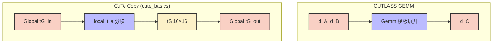
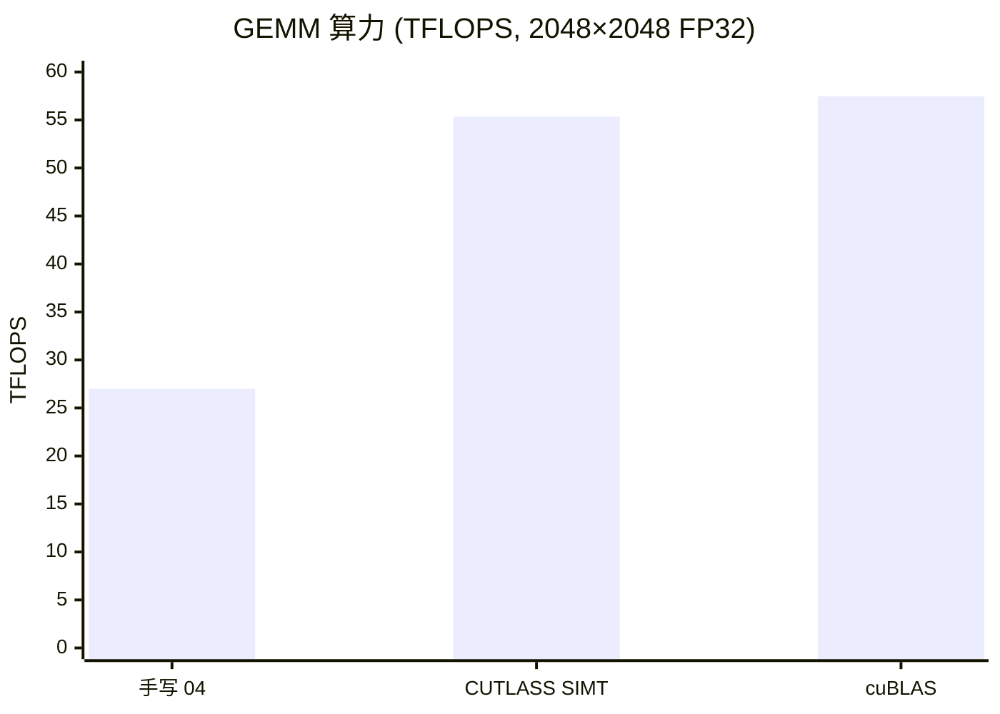

## 本文目标

读完本文，你将能够：

- 理解为什么手写「逼近 cuBLAS」的 GEMM 会陷入维护地狱：汇编级对齐、多级流水线寄存器排布、换架构即崩
- 掌握 CUTLASS 的四层解耦（Element / Warp MMA / Thread-Block Tile / Epilogue），以及如何用模板参数拼出高性能 GEMM
- 理解 Multi-Stage Pipeline 如何用更深流水掩盖 HBM 延迟，以及 Epilogue 融合如何避免「算完再写回再激活」的带宽浪费
- 用 CuTe 的 Layout / Tensor 把「下标与分块」表达成编译期代数，用 `make_layout`、`local_tile` 替代手写 `(i/8)*32+...` 式寻址

## 对应代码路径

> **硬件环境**：NVIDIA RTX 4090 (Ada Lovelace, sm_89)
> 128 SMs | FP32 82.6 TFLOPS | HBM 1008 GB/s | L2 72 MB | Roofline 拐点 81.9 FLOP/Byte

| 源文件 | Kernel 名称 | 核心技术 | 测试规模 |
|--------|-------------|----------|----------|
| `14_CUTLASS/01_cutlass_gemm/cutlass_gemm.cu` | `cutlass::gemm::device::Gemm` (OpClassSimt, Sm80) | CUTLASS 模板 GEMM、行主序、与 cuBLAS 对照 | M=N=K=2048 |
| `14_CUTLASS/02_tensorop_gemm/tensorop_gemm.cu` | `cutlass::gemm::device::Gemm` (OpClassTensorOp) | Tensor Core 混合精度 GEMM（本仓库为失败实验记录） | M=N=K=2048, FP16 |
| `14_CUTLASS/03_cute_basics/cute_basics.cu` | `cute_print_kernel`、`cute_copy_kernel` | CuTe `make_layout` / `make_tensor` / `local_tile` | 128×128 概念演示 |

> 本篇承接 [12 标准库与工程实践](/posts/a1e20e80/) 的 cuBLAS 天花板基准，回答「当需要融合 Epilogue（如 GEMM+ReLU）或特殊布局时，如何在不放弃性能的前提下用开源模板库替代黑盒」。CUTLASS 用模板生成接近甚至逼平 cuBLAS 的 Kernel；CuTe 则把分块与寻址抽象成编译期代数，避免手写下标地狱。

---

## 三个实现分别做了什么

### 1. CUTLASS SIMT GEMM：模板驱动的「可替换 cuBLAS」

`cutlass_gemm.cu` 不手写 Tiled GEMM 的循环与 `__syncthreads()`，而是通过**实例化** `cutlass::gemm::device::Gemm` 模板，指定元素类型、布局（RowMajor）、算子类（`OpClassSimt` 即 CUDA Core）与架构（`Sm80`）。运行时只做 `Gemm gemm_op; gemm_op(args);`，所有 Block/Tile 划分、Shared Memory 双缓冲、寄存器分配由模板在编译期展开成 PTX 级实现。

它的价值在于建立一个**可复现的工业基准**：同一块 GPU 上，手写 GEMM（如 [04 矩阵乘优化与寄存器分块](/posts/1a09f6f/)）约 25–28 TFLOPS，cuBLAS 约 57 TFLOPS；CUTLASS 仅改几行模板参数即可得到约 **55 TFLOPS**（约 96% cuBLAS）[实测]，且代码可读、可改 Epilogue 做融合。

```cpp
// 来源：14_CUTLASS/01_cutlass_gemm/cutlass_gemm.cu : L76-L87
using Gemm = cutlass::gemm::device::Gemm<
    float,                               // ElementA
    cutlass::layout::RowMajor,           // LayoutA
    float,                               // ElementB
    cutlass::layout::RowMajor,           // LayoutB
    float,                               // ElementC
    cutlass::layout::RowMajor,           // LayoutC
    float,                               // ElementAccumulator
    cutlass::arch::OpClassSimt,          // OperatorClass (CUDA Core)
    cutlass::arch::Sm80                  // 架构 (Ampere+)
>;

Gemm gemm_op;
```

与 cuBLAS 的 `cublasSgemm(handle, ...)` 不同，这里没有手写 Kernel：模板参数一旦定好，编译器生成整条 GEMM 流水线；换精度或加 Epilogue 只改类型与 Traits，不碰底层循环。

### 2. CUTLASS TensorOp GEMM：Tensor Core 的模板入口（本仓库为失败实验）

`tensorop_gemm.cu` 将算子类改为 `OpClassTensorOp`，元素改为 `half`（FP16），意图调用 Tensor Core 实现混合精度 GEMM。在当前仓库的测试环境（sm_89 + 所用 CUTLASS 版本/配置）下，运行时报 **CUTLASS Error: Error Internal**，Kernel 未成功发射，计时约 0.00 ms，故日志中的「238609 TFLOPS」为除以近零时间产生的**无效数值** [实测说明]。

它的价值在于说明：**即便使用顶级模板库，Tensor Core 路径对架构/对齐/Shared Memory 配置极其敏感**；一旦参数或环境不匹配，会直接失败而非「慢一点」。cuBLAS 在同样规模下可稳定跑出约 157 TFLOPS（FP16）[实测]，可作为 Tensor Core 性能的参照；CUTLASS TensorOp 需在修正配置后重新测速才有可比数据。

### 3. CuTe 基础：Layout 与 Tensor 的代数视图

`cute_basics.cu` 不做 GEMM，只演示 CuTe（CUTLASS 3.x 的代数核心）的两类用法：

- **Layout**：`make_layout(make_shape(3, 4), make_stride(4, 1))` 把「形状」与「步长」显式化，坐标 $(i,j)$ 到线性下标的映射在编译期完成，无需运行时乘除。
- **Tensor + Tiling**：用 `make_tensor(ptr, make_layout(shape, stride))` 把指针包装成带语义的 Tensor；用 `local_tile(tG_in, smem_shape{}, make_coord(bidy, bidx))` 把全局 Tensor 按 16×16 切块，当前 Block 只处理其中一块。线程用 `tS(ty, tx) = tG_in_tiled(ty, tx)` 完成 Global → Shared 搬运，下标清晰、无手写线性化。

```cpp
// 来源：14_CUTLASS/03_cute_basics/cute_basics.cu : L47-L79
auto tensor_shape = make_shape(M, N);
auto tensor_stride = make_stride(N, Int<1>{});

Tensor tG_in = make_tensor(make_gmem_ptr(g_in), make_layout(tensor_shape, tensor_stride));
using smem_shape = Shape<Int<16>, Int<16>>;
__shared__ T smem_data[size(smem_shape{})];
Tensor tS = make_tensor(make_smem_ptr(smem_data), make_layout(smem_shape{}));

Tensor tG_in_tiled = local_tile(tG_in, smem_shape{}, make_coord(bidy, bidx));
// ...
tS(ty, tx) = tG_in_tiled(ty, tx);
```

这样就不用手写 `row = blockIdx.y*16+ty; col = blockIdx.x*16+tx; idx = row*N+col` 等线性化，且 Shape/Stride 在编译期确定，无额外除模开销。

---

## Baseline 与瓶颈分析

### 手写高性能 GEMM 的天花板与代价

[04 矩阵乘优化与寄存器分块](/posts/1a09f6f/) 已经把手写 GEMM 推到约 25–28 TFLOPS（RTX 4090 FP32 峰值的约三分之一），再往上需要：寄存器双页/多级流水、`cp.async`、Warp 级 `mma.sync` 甚至手写 SASS。每代架构（Ampere → Hopper）的 Tile 形状、对齐、寄存器布局都会变，**手写代码几乎无法在保持可读的前提下跨代移植**。

若还要在 GEMM 后接「自定义激活 + Norm + Clamp」等融合尾段，cuBLAS 是黑盒，无法插入；只能先写回显存再启动下一 Kernel，带宽与延迟都会把前面算力的优势吃掉一大截。

### 性能基线（cuBLAS 作为天花板）

> 数据来源：`Results/14_CUTLASS.md` 原始日志

| Baseline 类别 | 测试场景 | 指标 | 值 | 数据性质 |
|---------------|----------|------|-----|----------|
| cuBLAS SGEMM | 2048×2048 FP32 | Kernel 耗时 / 算力 | 0.30 ms / **57.48 TFLOPS** | [实测] |
| cuBLAS Tensor Core | 2048×2048 FP16 | Kernel 耗时 / 算力 | 0.11 ms / **157.07 TFLOPS** | [实测] |

手写 04 的 GEMM 约 25–28 TFLOPS，与 cuBLAS 的 57 TFLOPS 相差约一倍；要逼平或接近，需要模板库级的代码生成与流水线封装。

### 三大瓶颈：为何不能只靠「继续手写」

1. **汇编/PTX 绑定**：启用 Tensor Core 需调用 `mma.sync` 等接口，对 $m,n,k$ 与线程布局有苛刻对齐；一旦硬件或驱动迭代，手写参数极易失效且难以排查。
2. **多级流水线的实现成本**：从双缓冲扩展到 3–4 级 Pipeline，需精细安排 `cp.async`、`__syncthreads()` 与寄存器分配，代码量爆炸且易出错，可维护性极差。
3. **Epilogue 无法融合**：cuBLAS 只给「矩阵乘 + 线性组合」；若需要 GEMM 后接 Swish/Norm/Clamp，只能在库外再写 Kernel，数据多一次显存往返。

---

## 优化思路：四层抽象、多级流水与 CuTe 代数

### 核心思想

- **CUTLASS 四层**：Element（数据类型）→ Warp MMA（Warp 级矩阵乘指令形状）→ Thread-Block Tile（分块与 Shared Memory 流水）→ Epilogue（写回与可选融合）。每层由模板参数描述，编译器生成对应 PTX；换精度、换架构、加 Epilogue 只改参数，不重写底层逻辑。
- **Multi-Stage Pipeline**：把「双缓冲」扩展为 3 或 4 级流水，让计算与 HBM 搬运在时间上错峰，用更多 on-chip 缓冲掩盖延迟；代价是寄存器占用上升，需在 Occupancy 与 Stage 数之间权衡。
- **CuTe 代数**：用 Layout（Shape + Stride）和 Tensor 把「坐标 → 线性索引」全部放在编译期；Slice / Partition / Tiling 用 `local_tile`、`partition` 等高层接口表达，避免手写 `(i/8)*32 + j%8` 式的易错与低效。

### CUTLASS 与手写 / cuBLAS 的定位

| 方式 | 性能量级 | 可融合 Epilogue | 可维护性 / 移植 |
|------|-----------|-----------------|------------------|
| 手写 Tiled GEMM（04） | 约 25–28 TFLOPS | 可自写 | 高理解成本，换架构易崩 |
| cuBLAS | 约 57 TFLOPS (FP32) / 157 (FP16 TC) | 否 | 黑盒，无源码 |
| CUTLASS 模板 | 约 55 TFLOPS (SIMT) / TC 需正确配置 | 是（Epilogue 可定制） | 模板编译慢，但可读可改 |

### 存储与抽象层级

CUTLASS/CuTe 把「谁负责什么」从手写一团循环里抽出来，变成编译期可组合的层：

| 层级 | 职责 | 对应 01 的直觉 |
|------|------|----------------|
| Element / Layout | 数据类型与内存布局（RowMajor 等） | 与 01 的「行主序 $A[row*K+k]$」一致 |
| Thread-Block Tile | Block 内协作加载 Tile、双缓冲/多级流水 | 01 的 Shared Memory Tiling 的「工业加强版」 |
| Epilogue | 写回 $C$、可选 Elementwise（ReLU 等） | 01 只写回；这里可融合避免再读一次显存 |

---

## 关键代码解释

### CUTLASS GEMM 的 Arguments 与调用

```cpp
// 来源：14_CUTLASS/01_cutlass_gemm/cutlass_gemm.cu : L109-L116
Gemm::Arguments args(
    {M, N, K},                    // 问题规模
    {d_A, K},                     // A 的指针与 leading dimension
    {d_B, N},                     // B
    {d_C, N},                     // C 输入（若 beta!=0）
    {d_C, N},                     // D 输出（本示例 C 覆盖写）
    {1.0f, 0.0f}                  // alpha, beta
);
// ...
gemm_op(args);
```

与 cuBLAS 的 `cublasSgemm(handle, ..., d_A, lda, d_B, ldb, ...)` 类似，Arguments 把规模、指针、ld、标量打包；执行时 `gemm_op(args)` 内部完成 Grid/Block 配置与 Kernel 启动。本仓库示例使用 RowMajor，与 [12 标准库与工程实践](/posts/a1e20e80/) 中的行主序一致。

### CuTe：从全局 Tensor 到 Block 局部 Tile

```cpp
// 来源：14_CUTLASS/03_cute_basics/cute_basics.cu : L66-L79
Tensor tG_in_tiled = local_tile(tG_in, smem_shape{}, make_coord(bidy, bidx));
Tensor tG_out_tiled = local_tile(tG_out, smem_shape{}, make_coord(bidy, bidx));
// 当前线程在 Tile 内坐标
int tx = threadIdx.x % 16;
int ty = threadIdx.x / 16;
// ...
tS(ty, tx) = tG_in_tiled(ty, tx);
__syncthreads();
tG_out_tiled(ty, tx) = tS(ty, tx);
```

`local_tile(tensor, tile_shape, block_coord)` 在语义上等价于「把大 Tensor 按 `tile_shape` 切块，取第 `block_coord` 块」；返回的是该块上的视图，线程用局部坐标 `(ty, tx)` 访问。与 01 的 Tiled GEMM 相比：01 里是手写 `row = blockIdx.y*TILE_WIDTH+ty`、`mCol = tile*TILE_WIDTH+tx`；CuTe 用 `local_tile` 一次表达「当前 Block 负责的那一块」，下标逻辑由编译期代数完成。

### Block / Grid 与调用层级

| 层级 | 配置或职责 |
|------|------------|
| CUTLASS `Gemm` | 内部决定 Grid/Block、Tile 形状；用户不直接写 launch 参数 |
| CuTe `cute_copy_kernel` | Grid `(N/16, M/16)`，Block 256 线程；每线程在 16×16 Tile 内用 `(ty,tx)` 搬运一元素 |
| 模板实例化（`using Gemm = ...`） | 确定精度、布局、OpClass、架构，生成对应 Kernel 代码 |

### 数据流总览（CUTLASS GEMM 与 CuTe Copy）



---

## 结果与边界

### CUTLASS SIMT GEMM vs cuBLAS（2048×2048，20 次迭代取平均）

> 数据来源：`Results/14_CUTLASS.md` 原始日志

| 版本 | Kernel 耗时 | 计算吞吐 (TFLOPS) | vs cuBLAS | 数据性质 |
|------|-------------|-------------------|-----------|----------|
| cuBLAS SGEMM | 0.30 ms | **57.48** | 1.00x | [实测] |
| **CUTLASS GEMM (SIMT)** | **0.31 ms** | **55.35** | **96.3%** | [实测] |

手写 04 的 GEMM 约 25–28 TFLOPS；同一块 GPU 上，仅通过 CUTLASS 模板实例化（未启用 Tensor Core）即可达到 cuBLAS 的 **96.3%** [实测]，说明「模板生成 + 编译器优化」在 SIMT 路径上已能逼近闭源库。



### 为什么 CUTLASS 能逼近 cuBLAS 而手写 04 只有约一半

手写 04 的 GEMM 已经做了 Shared Memory Tiling 和寄存器分块，但**多级流水**（双缓冲/三缓冲）、**Warp 级 MMA 排布**与**Epilogue 与主循环重叠**等细节仍依赖大量手写与调参。CUTLASS 把这些都编码进模板：编译器为当前架构选出 Tile 形状、展开循环、分配寄存器，因此同一块卡上能逼近 cuBLAS。代价是编译时间变长、模板报错信息难读；换来的是「改几行参数即可换精度/架构/Epilogue」。

### TensorOp 实验失败说明（不视为有效性能）

| 版本 | Kernel 耗时 | 计算吞吐 | 数据性质 |
|------|-------------|----------|----------|
| cuBLAS Tensor Core (FP16) | 0.11 ms | **157.07 TFLOPS** | [实测] |
| CUTLASS TensorOp（本仓库） | 0.00 ms（未成功发射） | — | [失败实验：无效] |

日志中出现多次 `CUTLASS Error: Error Internal`，Kernel 未真正执行；由 0.00 ms 算出的「238609 TFLOPS」为无效数值。原因可能与 sm_89 下 CUTLASS TensorOp 的配置（如 kBlockSize、对齐、Shared Memory 上限）未完全适配有关。**比较 Tensor Core 性能时请仅参考 cuBLAS 一行**；CUTLASS TensorOp 需在修正配置后重新测试。

### 边界与局限

- **编译时间与模板深度**：CUTLASS 实例化会展开大量模板，单次编译可能达数十秒，报错信息冗长；适合作为独立模块编译，不宜在超大工程中全量展开。
- **TensorOp 与架构适配**：Tensor Core 的 Tile 形状、对齐随架构变化，CUTLASS 需选用与当前 GPU（如 sm_89）匹配的预定义配置，否则易出现 Internal 错误或错误结果。
- **何时用 CUTLASS、何时用 cuBLAS**：若只需「纯 GEMM」且无融合需求，cuBLAS 仍是省心且峰值有保障的选择；当需要 **Epilogue 融合**（GEMM+激活/Norm）或特殊布局时，CUTLASS 才能发挥「可改、可融合」的优势。

---

## 常见误区

1. **误区**：用了 CUTLASS 就可以完全抛弃 cuBLAS。
   **实际**：在「纯 GEMM、无融合」场景下，cuBLAS 由 NVIDIA 针对各架构深度调优，峰值往往略高于 CUTLASS 默认配置。CUTLASS 的价值在于**可定制 Epilogue、可读可改的生成代码**；只有在需要融合或特殊布局时才值得替换 cuBLAS。

2. **误区**：CUTLASS TensorOp 报错说明库有 bug。
   **实际**：Tensor Core 对问题规模、对齐、Shared Memory、架构版本极其敏感。`Error Internal` 多与当前 CUTLASS 版本/选项与 sm_89（或当前驱动）的匹配有关，需对照官方示例与文档做配置修正，而非认定库不可用。

3. **误区**：CuTe 只是换一种写法，对性能没帮助。
   **实际**：CuTe 把 Shape/Stride/Tile 都推到编译期，下标与分块变成常量或简单线性式，可避免运行时的除法和复杂索引；同时提高可读性、减少越界与写错步长的概率，间接有利于维护与优化。

4. **误区**：模板 GEMM 一定比手写慢。
   **实际**：本仓库实测 CUTLASS SIMT 55.35 TFLOPS，手写 04 约 25–28 TFLOPS；模板展开后由编译器做寄存器分配与指令调度，在 SIMT 路径上已经明显优于典型手写实现，且无需手写多级流水与 Epilogue。

---

## 系列导航

### 前置阅读

| 文章 | 与本篇的衔接 |
|------|----------------|
| [01 基础概念与分块](/posts/7608f1b0/) | Tiled GEMM 与 Shared Memory 同步；本篇用模板生成「更强版 Tiling + 流水线」 |
| [04 矩阵乘优化与寄存器分块](/posts/1a09f6f/) | 手写 GEMM 的极限约 25–28 TFLOPS；本篇 CUTLASS 达 55 TFLOPS，作为「模板替代手写」的对照 |
| [12 标准库与工程实践](/posts/a1e20e80/) | cuBLAS 作为性能天花板；本篇讨论何时用 CUTLASS 替代/补充 cuBLAS（融合 Epilogue、可维护性） |

### 推荐后续（承上启下）

| 文章 | 与本篇的衔接 |
|------|----------------|
| [09 张量核心与混合精度](/posts/78e375e8/) | Tensor Core 与 FP16；本篇 TensorOp 为同方向上的模板实现（本仓库当前为失败实验，可对照 cuBLAS TC 数据） |
| [13 性能分析、屋顶线与占用率](/posts/803b94d6/) | 用 Nsight 与 Roofline 量化 CUTLASS 与 cuBLAS 的算力/带宽，验证本篇基准 |
| [15 多卡通信与全归约](/posts/b599e19f/) | 单机单卡优化收官后，多卡与分布式全归约 |

---

## 顺序导航

- 上一篇：[CUDA实践-13-性能分析屋顶线与占用率](/posts/803b94d6/)
- 下一篇：[CUDA实践-15-多卡通信与全归约](/posts/b599e19f/)
