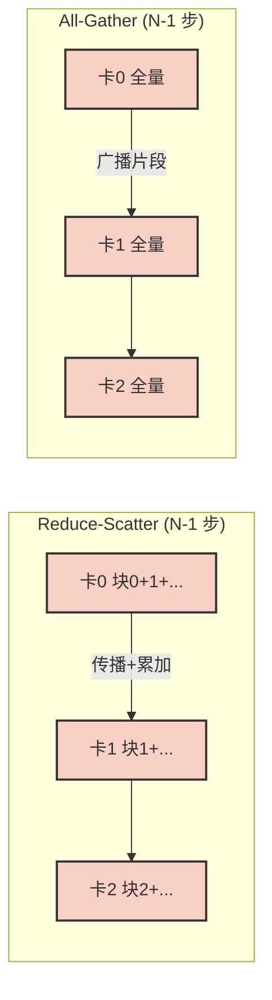
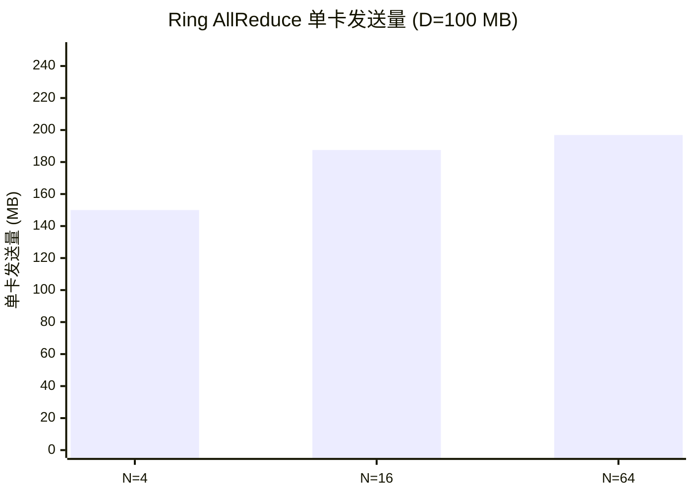

## 本文目标

读完本文，你将能够：

- 理解参数服务器 (Parameter Server) 在分布式训练中的可扩展性瓶颈：主节点通信负载 $O(N)$ 与单点瘫痪
- 掌握 Ring AllReduce 的两阶段（Reduce-Scatter 与 All-Gather）数学推导，以及单卡通信量如何收敛到 $2D$ 常数
- 在 CUDA C++ 中用 NCCL 的 `ncclGroupStart` / `ncclAllReduce` / `ncclGroupEnd` 与 `cudaSetDevice` 正确绑定多卡上下文、执行设备间归约
- 分析显卡互联拓扑（PCIe 与 NVLink）对通信延迟和吞吐量的影响，以及冷启动在实测耗时中的占比

## 对应代码路径

> **硬件环境**：2 × NVIDIA RTX 4090 (Ada Lovelace, sm_89)
> 单卡 FP32 82.6 TFLOPS | 全局显存 24 GB | 总线拓扑：PCIe Gen4 x16（无 NVLink）

| 源文件 | Kernel / API 名称 | 核心技术 | 测试规模 |
|--------|------------------|----------|----------|
| `15_Multi_GPU/01_nccl_allreduce/nccl_allreduce.cu` | `init_data_kernel`、`ncclAllReduce`（含 Group 初始化） | NCCL Group API、`cudaSetDevice` 绑定、多卡梯度求和同步 | size = 1024×1024 Float (4 MB) |

> 本篇在系列中的位置：承接 [08 多流、图执行与扩展开发](/posts/b1c0c6a3/)、[11 推理优化、融合与键值缓存](/posts/9729c03f/)、[12 标准库与工程实践](/posts/a1e20e80/)、[13 性能分析、屋顶线与占用率](/posts/803b94d6/) 中单机/单卡调度、算子优化与性能建模的内容，本篇将视角扩展到 **多 GPU 通信拓扑与 AllReduce 算法本身**，回答「当单卡 Kernel 已跑满后，多卡训练/推理还卡在哪里，以及 Ring AllReduce / NCCL 如何在物理拓扑上逼近极限」。

---

## 三个实现分别做了什么

### 1. NCCL 通信子初始化与多卡资源绑定

多卡通信前必须为每张卡绑定正确的 CUDA 上下文，并在**同一组**内完成显存分配、流创建与通信子注册。否则会出现「Rank 0 等 Rank 1 发数据、主线程却卡在 Rank 0 上无法给 Rank 1 下发指令」的死锁。

本实现用 `ncclGroupStart()` 与 `ncclGroupEnd()` 包裹一个循环：在循环内对每张卡依次 `cudaSetDevice(i)`，再在该设备上 `cudaMalloc`、`cudaStreamCreate`、`ncclCommInitRank`。NCCL 会将这段「多卡配置」缓存在一起，在 `ncclGroupEnd()` 时统一提交给底层 Proxy，避免串行等待导致的互相挂起。

它的价值在于建立**正确的多卡编程习惯**：凡涉及多卡的 NCCL 调用，都应放在 Group 内，且每次操作前用 `cudaSetDevice(i)` 锚定当前设备。

```cpp
// 来源：15_Multi_GPU/01_nccl_allreduce/nccl_allreduce.cu : L79-L93
NCCLCHECK(ncclGroupStart());
for (int i = 0; i < nDev; ++i) {
    CUDA_CHECK(cudaSetDevice(i));
    CUDA_CHECK(cudaMalloc((void**)&d_sendbuffs[i], size_bytes));
    CUDA_CHECK(cudaMalloc((void**)&d_recvbuffs[i], size_bytes));
    CUDA_CHECK(cudaStreamCreate(&streams[i]));
    // ... 每卡数据初始化 ...
    NCCLCHECK(ncclCommInitRank(&comms[i], nDev, id, i));
}
NCCLCHECK(ncclGroupEnd());
```

未正确包裹时，主线程在设备 0 上等待设备 1 的通信就绪，而设备 1 的初始化尚未被下发，形成死锁。

### 2. 每卡数据初始化：用 rank 区分输入

AllReduce 的语义是「所有卡上的张量按元素求和，结果写回每张卡」。为验证正确性，每张卡需要不同的初值：例如卡 0 全 0、卡 1 全 1，则求和后每卡应得到 1.0（0+1）。

`init_data_kernel` 在每卡的 `d_sendbuffs[i]` 上写入 `rank`（即设备编号），使用该卡自己的 `streams[i]` 启动，保证在调用 `ncclAllReduce` 前数据已就绪。

```cpp
// 来源：15_Multi_GPU/01_nccl_allreduce/nccl_allreduce.cu : L33-L39
__global__ void init_data_kernel(PFloat data, int rank, CInt size) {
    int tid = blockIdx.x * blockDim.x + threadIdx.x;
    if (tid < size) {
        data[tid] = static_cast<float>(rank);
    }
}
```

Kernel 配置为 256 线程/Block，Grid 覆盖 `num_elements`（1024×1024）。每卡独立 launch，互不阻塞。

### 3. AllReduce 执行与跨卡同步

`ncclAllReduce(sendbuf, recvbuf, count, ncclFloat, ncclSum, comm, stream)` 将本卡的 `sendbuf` 与其它所有卡的对应缓冲区做按元素求和，结果写回本卡的 `recvbuf`。库内部会自动选择 Ring 或 Tree 等拓扑；传入每卡专属的 `streams[i]`，使通信挂在异步流上，主线程提交后即可继续，最后通过 `cudaStreamSynchronize(streams[i])` 等待并计时。

```cpp
// 来源：15_Multi_GPU/01_nccl_allreduce/nccl_allreduce.cu : L100-L107
NCCLCHECK(ncclGroupStart());
for (int i = 0; i < nDev; ++i) {
    CUDA_CHECK(cudaSetDevice(i));
    NCCLCHECK(ncclAllReduce((const void*)d_sendbuffs[i], (void*)d_recvbuffs[i],
                            num_elements, ncclFloat, ncclSum, comms[i], streams[i]));
}
NCCLCHECK(ncclGroupEnd());
```

AllReduce 调用本身也放在 Group 内，保证多卡同时进入通信阶段，避免一侧先发、另一侧未收导致的挂起或错误。

---

## Baseline 与瓶颈分析

### Parameter Server 的可扩展性瓶颈

在传统的 Parameter Server 架构中，$N$ 个工作节点各自计算梯度后，将梯度发往主节点；主节点聚合后再把更新后的参数发回各节点。设梯度总量为 $D$ 字节，则主节点在每轮同步中需接收 $(N-1) \times D$ 字节、再发出 $N \times D$ 字节（或等价流量），即主节点进出带宽需求随 $N$ **线性增长** [理论]。其余 $(N-1)$ 张卡的链路大部分时间闲置，整体硬件利用率极低，且主节点一旦成为瓶颈，扩展节点数反而拉长每轮时间。

### Ring AllReduce 的单卡负载常数界

Ring AllReduce 将 $N$ 张卡逻辑上连成单向环，数据 $D$ 切成 $N$ 块。第一阶段 **Reduce-Scatter**：经过 $N-1$ 步，每块在环上传播并逐卡累加，结束时每卡持有 $1/N$ 的「已全归约」片段。第二阶段 **All-Gather**：再经 $N-1$ 步，将这些片段在环上广播，最终每卡得到完整结果。每张卡在每步只与左右邻居收发一块数据，发送量与接收量均为 $\frac{N-1}{N} \times D$；两阶段合计约 $2 \times \frac{N-1}{N} \times D$。当 $N \to \infty$ 时，单卡通信量收敛到 **$2D$** [理论]，与节点数无关。

$$\text{单卡收发量} \to 2 \times \frac{N-1}{N} \times D \xrightarrow{N \to \infty} 2D \quad [\text{理论}]$$

### 物理总线与冷启动对实测的影响

在缺乏 NVLink 的消费级/工作站主板上，多卡只能通过 PCIe 经北桥/系统内存中转，理论双向带宽约 26 GB/s（PCIe Gen4 x16），且延迟远高于 NVLink。本实验 2×RTX 4090 无直连，4 MB 数据 AllReduce 实测 **28.20 ms** [实测]，等效带宽仅百兆量级。其中很大一部分来自**冷启动**：首次调用需探明拓扑、建立通信、在驱动层锁定资源，后续热态同样规模会快很多。因此 28.20 ms 不能简单换算为「4 MB 的纯传输时间」，更多反映「冷启动 + PCIe 路径」的综合成本。

### 隐式上下文绑定错误

与单卡 `cudaMalloc` 类似，NCCL 的显存与流都绑定在「当前设备」上。若在循环中忘记对每张卡调用 `cudaSetDevice(i)`，所有 `cudaMalloc`、`ncclAllReduce` 会落在默认设备（通常为 0）上，导致其它卡未参与或句柄错误，引发死锁或 SegFault。**多卡循环内必须先 `cudaSetDevice(i)` 再操作该卡资源**。

---

## 优化思路：拓扑替换、Group 提交与通信计算重叠

### 核心思想

- **拓扑替换（Ring AllReduce）**：消除中心节点，让每卡只与环上邻居通信，单卡负载从 $O(N)$ 降为常数 $2D$，可扩展性由主节点带宽转为环上链路带宽。
- **NCCL Group API**：用 `ncclGroupStart()` / `ncclGroupEnd()` 把多卡上的初始化与 AllReduce 打包成一次「事务」，由 Proxy 统一调度，避免主线程在设备 0 上阻塞导致设备 1 无法收到指令的死锁。
- **通信与计算重叠（Pipeline）**：在 DDP 等框架中，梯度按层或按桶产生后，不等全部算完即把已就绪部分通过 `cudaMemcpyAsync` 等丢给通信链路，SM 继续算剩余部分，用计算掩盖通信延迟。

### Ring 与 Parameter Server 负载对比

以总数据量 $D = 100$ MB、$N$ 张卡为例：

| 节点数 $N$ | Parameter Server 主节点负载 | Ring AllReduce 单卡发送量 |
|------------|-----------------------------|----------------------------|
| 4 | $(N-1) \times D = 300$ MB | $2 \times \frac{N-1}{N} \times D = 150$ MB [理论] |
| 64 | $6300$ MB | $\approx 196.9$ MB [理论] |
| $N \to \infty$ | $O(N)$ 瘫痪 | $\to 2D = 200$ MB [理论] |

### 通信层级与延迟来源

| 环节 | 作用 | 本实验中的表现 |
|------|------|----------------|
| NCCL Group | 多卡指令打包、统一提交，避免死锁 | 初始化与 AllReduce 均包裹在 Group 内 |
| cudaSetDevice | 锚定当前设备，保证 Malloc/Stream/Comm 绑定正确卡 | 每次循环迭代首行 |
| PCIe vs NVLink | 无直连时数据经系统内存，带宽与延迟均劣于 NVLink | 2×4090 无 NVLink，4 MB 冷启动约 28 ms [实测] |

---

## 关键代码解释

### NCCL 执行环境绑定与初始化

```cpp
// 来源：15_Multi_GPU/01_nccl_allreduce/nccl_allreduce.cu : L79-L93
NCCLCHECK(ncclGroupStart());
for (int i = 0; i < nDev; ++i) {
    CUDA_CHECK(cudaSetDevice(i));
    CUDA_CHECK(cudaMalloc((void**)&d_sendbuffs[i], size_bytes));
    CUDA_CHECK(cudaMalloc((void**)&d_recvbuffs[i], size_bytes));
    CUDA_CHECK(cudaStreamCreate(&streams[i]));
    // init_data_kernel<<<...>>>(d_sendbuffs[i], i, num_elements);
    NCCLCHECK(ncclCommInitRank(&comms[i], nDev, id, i));
}
NCCLCHECK(ncclGroupEnd());
```

- **Group**：多卡上的 NCCL 调用必须放在 `ncclGroupStart()` 与 `ncclGroupEnd()` 之间，否则会因「Rank 0 等 Rank 1、主线程却堵在 Rank 0」而死锁。
- **cudaSetDevice(i)**：确保本轮循环中的 `cudaMalloc`、`cudaStreamCreate`、`ncclCommInitRank` 都作用在设备 $i$ 上。

### AllReduce 流执行

```cpp
// 来源：15_Multi_GPU/01_nccl_allreduce/nccl_allreduce.cu : L100-L107
NCCLCHECK(ncclGroupStart());
for (int i = 0; i < nDev; ++i) {
    CUDA_CHECK(cudaSetDevice(i));
    NCCLCHECK(ncclAllReduce((const void*)d_sendbuffs[i], (void*)d_recvbuffs[i],
                            num_elements, ncclFloat, ncclSum, comms[i], streams[i]));
}
NCCLCHECK(ncclGroupEnd());
```

- `ncclAllReduce` 会按库内策略选择 Ring 或 Tree 等算法；传入 `streams[i]` 使通信异步，主线程在 `ncclGroupEnd()` 后即可执行后续代码，最后用 `cudaStreamSynchronize(streams[i])` 等待并计时。

### 调用层级与职责

| 层级 | 职责 |
|------|------|
| ncclGetUniqueId | 生成全局唯一 ID，供所有进程/卡创建同一通信域 |
| ncclGroupStart / ncclGroupEnd | 将多卡上的 NCCL 调用打包为一次提交，避免串行死锁 |
| cudaSetDevice(i) | 在循环中锚定当前设备，保证资源绑定正确 |
| ncclAllReduce(..., comms[i], streams[i]) | 每卡在各自流上参与 AllReduce，结果写回本卡 recvbuff |

### 数据流概览（Ring AllReduce 两阶段）



每卡总收发量 $2 \times \frac{N-1}{N} \times D \to 2D$（$N \to \infty$）。

---

## 结果与边界

### NCCL AllReduce 耗时（2×RTX 4090，4 MB Float，冷启动）

> 数据来源：`Results/15_Multi_GPU.md` 原始日志

| 实现 | 测试场景 | AllReduce 耗时 | 数据性质 |
|------|----------|----------------|----------|
| **NCCL AllReduce** | C++ 裸调，含冷启动 | **28.20 ms** | [实测] |
| 数据规模 | 1024×1024 float | 4.00 MB | [理论] |

实测 4 MB 需 28.20 ms，等效带宽仅百兆量级。其中绝大部分来自**冷启动**（探明拓扑、建立通信、驱动资源锁定）；热态同规模会明显更短。在无 NVLink 的 PCIe 拓扑下，多卡数据需经系统内存中转，延迟与带宽均受限于 PCIe，大模型机房常采用 NVSwitch 等直连以突破该瓶颈。

### Ring 单卡负载常数界验证（$D = 100$ MB）

| 节点数 $N$ | Parameter Server 主节点负载 | Ring AllReduce 单卡发送量 |
|------------|-----------------------------|----------------------------|
| 4 | 300 MB | $2 \times \frac{3}{4} \times 100 = 150$ MB [理论] |
| 64 | 6300 MB | $\approx 196.9$ MB [理论] |
| $N \to \infty$ | $O(N)$ | $\to 200$ MB ($2D$) [理论] |

随 $N$ 增大，Ring 下单卡负载收敛到 $2D$，而 Parameter Server 主节点负载线性增长，无法扩展。



随 $N$ 增大，单卡发送量收敛于 $2D = 200$ MB，与节点数无关；而 Parameter Server 主节点负载为 $(N-1)D$，线性增长。

### 边界条件与局限

- **无 NVLink 的惩罚**：RTX 4090 多卡间无直连，数据需经 PCIe 进出系统内存再到达对侧卡，系统颠簸与延迟明显；带 NVSwitch 的机柜可避免该路径。
- **拓扑与算法选择**：节点数多或跨机时，纯 Ring 可能被最慢链路拖成木桶短板；工业部署常配合 `NCCL_ALGO=Tree` 等按层级聚合的策略。
- **冷启动与热态**：首次运行包含拓扑发现与资源建立，耗时不能等价为「纯 4 MB 传输时间」；评估多卡通信性能时建议预热后再测。

---

## 常见误区

1. **误区**：多卡训练慢是因为 CPU/网卡要把上百 GB 的结果全算一遍。
   **实际**：归约本身的加法对 CPU/网卡而言很轻。多卡通信慢主要来自 **PCIe 等链路的物理延迟** 以及未被计算掩盖的等待时间；通过 Pipeline 重叠通信与计算可显著缓解。

2. **误区**：只要按 Ring 把卡接好就能解决所有多卡性能问题。
   **实际**：在跨节点或混合拓扑下，纯 Ring 可能被最慢一段拖慢整体。工业上常依赖 NCCL 的 Tree 等算法或环境变量（如 `NCCL_ALGO=Tree`）做分层聚合。

3. **误区**：多卡循环里不用 `cudaSetDevice`，只要每张卡都分配了显存就行。
   **实际**：若不按卡 `cudaSetDevice(i)`，所有 `cudaMalloc`、流和 NCCL 调用会落在默认设备上，其它卡未参与，易死锁或段错误。**每次操作某张卡前必须切到该设备**。

4. **误区**：28.20 ms 说明 4 MB 的 AllReduce 带宽只有约 0.14 GB/s。
   **实际**：该耗时包含冷启动（拓扑发现、建连、资源锁定），不能等价为 4 MB 的纯传输时间。热态同规模通常更快；要评估「纯通信带宽」应在预热后多次取平均。

---

## 系列导航

### 前置阅读

| 文章 | 与本篇的衔接 |
|------|----------------|
| [08 多流、图执行与扩展开发](/posts/b1c0c6a3/) | 理解单机上如何用 Stream / CUDA Graphs 做通信与计算重叠，是扩展到多卡 Pipeline 的基础 |
| [11 推理优化、融合与键值缓存](/posts/9729c03f/) | 先看单机 LLM 推理/训练中如何榨干算力与显存，再在本篇基础上思考多卡训练中 AllReduce 带来的新瓶颈 |
| [13 性能分析、屋顶线与占用率](/posts/803b94d6/) | 用 Roofline/带宽模型理解 Parameter Server 与 Ring AllReduce 在通信带宽上的理论差异 |

### 推荐后续（承上启下）

| 文章 | 与本篇的衔接 |
|------|----------------|
| [12 标准库与工程实践](/posts/a1e20e80/) | 多卡训练中局部算子仍依赖高性能标准库，需与通信优化一起考虑整体吞吐 |
| [14 模板矩阵乘与代数布局](/posts/f1b57921/) | 当 AllReduce 开销被压缩后，局部 GEMM/Attention 将重新成为瓶颈，可依赖 CUTLASS/CuTe 逼近 cuBLAS |

---

## 顺序导航

- 上一篇：[CUDA实践-14-模板矩阵乘与代数布局](/posts/f1b57921/)
- 下一篇：无，建议返回 [CUDA实践-00-系列导读与学习路线](/posts/d6fa227a/) 重新选择学习路线。
